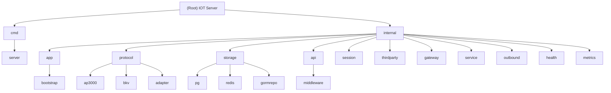

# IOT Server - 充电桩物联网服务器

> AI Context Documentation - Last Updated: 2025-11-28T11:47:52+08:00

## Change Log (Changelog)

### 2025-11-28
- Initial AI context documentation generated
- Added comprehensive module structure diagram
- Documented all major internal modules
- Created module-level CLAUDE.md files

---

<!-- OPENSPEC:START -->
# OpenSpec Instructions

These instructions are for AI assistants working in this project.

Always open `@/openspec/AGENTS.md` when the request:
- Mentions planning or proposals (words like proposal, spec, change, plan)
- Introduces new capabilities, breaking changes, architecture shifts, or big performance/security work
- Sounds ambiguous and you need the authoritative spec before coding

Use `@/openspec/AGENTS.md` to learn:
- How to create and apply change proposals
- Spec format and conventions
- Project structure and guidelines

Keep this managed block so 'openspec update' can refresh the instructions.

<!-- OPENSPEC:END -->

---

## Project Vision

IOT Server 是一个专为充电桩设备设计的**高性能、高可用**物联网服务器，支持 50,000+ 并发设备连接。核心能力包括：

- **多协议设备接入**：AP3000、BKV、GN 等主流充电桩协议
- **实时数据采集与控制**：设备状态监控、充电会话管理、远程启停
- **可靠事件推送**：基于 Outbox 模式的第三方 Webhook 集成
- **分布式会话管理**：基于 Redis 的高性能会话存储
- **高可用保障**：健康检查、限流熔断、优雅停机

### 技术栈

- **Runtime**: Go 1.25.4
- **Web Framework**: Gin (HTTP API)
- **Database**: PostgreSQL 15 (主数据库) + Redis 7 (会话/队列)
- **Observability**: Prometheus + Zap Logger + Lumberjack
- **Deployment**: Docker Compose + GitHub Actions CI/CD

---

## Architecture Overview

### Layered Architecture

```
┌─────────────────────────────────────────────────────────┐
│                     Entry Point                         │
│                  cmd/server/main.go                     │
└─────────────────────────────────────────────────────────┘
                           │
         ┌─────────────────┴─────────────────┐
         │                                   │
    ┌────▼─────┐                      ┌─────▼────┐
    │   HTTP   │                      │   TCP    │
    │  Server  │                      │ Gateway  │
    │  (Gin)   │                      │          │
    └────┬─────┘                      └─────┬────┘
         │                                   │
    ┌────▼─────────────────────────────────▼────┐
    │         Application Layer                 │
    │   (internal/app - Dependency Injection)   │
    └────┬──────────────────────────────────────┘
         │
    ┌────▼──────────────────────────────────────┐
    │         Business Layer                    │
    │  Protocol Adapters │ Services │ API       │
    │  (ap3000/bkv/gn)  │ (card/   │ (handlers)│
    │                    │  pricing)│           │
    └────┬──────────────────────────────────────┘
         │
    ┌────▼──────────────────────────────────────┐
    │         Infrastructure Layer              │
    │  Storage │ Session │ ThirdParty │ Metrics │
    │  (pg/    │ (redis) │ (webhook)  │ (prom)  │
    │   redis) │         │            │         │
    └───────────────────────────────────────────┘
```

### Key Design Patterns

- **Adapter Pattern**: Protocol drivers decoupled via `DriverCore` abstraction
- **Event-Driven**: `CoreEvent` standardizes device events, `EventQueue` handles async push
- **Outbox Pattern**: Reliable event delivery preventing message loss
- **Circuit Breaker**: TCP connection rate limiting and protection

---

## Module Structure Diagram



---

## Module Index

| Module Path | Responsibility | Entry Point | Tests |
|------------|---------------|-------------|-------|
| `cmd/server` | Application entry point, Swagger annotations | `main.go` | N/A |
| `internal/app` | Bootstrap & dependency injection (9-stage startup) | `bootstrap/app.go` | `*_test.go` |
| `internal/protocol/ap3000` | AP3000 protocol parser and handlers | `handlers.go`, `parser.go` | `*_test.go` |
| `internal/protocol/bkv` | BKV protocol parser, handlers, event emission | `handlers.go`, `parser.go`, `router.go` | `handlers_test.go` |
| `internal/storage/pg` | PostgreSQL repository (devices, orders, cmd_log) | `repo.go`, `pool.go` | N/A |
| `internal/storage/redis` | Redis-based outbound queue | `outbound_queue.go` | `outbound_queue_test.go` |
| `internal/api` | HTTP REST API routes and handlers | `readonly_routes.go`, `thirdparty_routes.go` | N/A |
| `internal/session` | Distributed session management (Redis) | `redis_manager.go` | `redis_manager_test.go` |
| `internal/thirdparty` | Webhook event pusher, deduper, event queue | `pusher.go`, `event_queue.go` | `pusher_test.go` |
| `internal/gateway` | TCP connection handler, protocol router | `conn_handler.go` | N/A |
| `internal/service` | Business logic (card service, pricing engine) | `card_service.go`, `pricing.go` | N/A |
| `internal/outbound` | Outbound message priority queue and worker | `redis_worker.go`, `priority.go` | N/A |
| `internal/health` | Health check aggregator (DB, Redis, TCP) | `aggregator.go`, `http_routes.go` | N/A |
| `internal/metrics` | Prometheus metrics registry | `metrics.go` | N/A |
| `internal/config` | Viper-based configuration loader | `config.go` | N/A |
| `internal/coremodel` | Domain models (port status, events) | `model.go`, `port_status.go` | `port_status_test.go` |

---

## Running and Development

### Prerequisites

- Docker 20.10+
- Docker Compose 2.0+
- Go 1.25.4+ (for local development)
- Make

### Quick Start (Docker)

```bash
# Clone repository
git clone <repo-url>
cd iot-server

# Copy environment config
cp scripts/env.example .env

# Deploy all services (PostgreSQL + Redis + IOT Server)
make deploy

# Verify health
curl http://localhost:7055/healthz
```

### Local Development

```bash
# Start dependencies (PostgreSQL + Redis)
make dev-up

# Run application (uses configs/local.yaml)
make dev-run

# Alternative: Debug mode (IDE-friendly)
make debug-all
```

### Build & Test

```bash
# Run all tests (with race detection)
make test-all

# Quick test (no race)
make test-quick

# Generate coverage report
make test-coverage

# Format code
make fmt

# Lint check
make lint

# Build binary
make build
```

---

## Testing Strategy

### Test Organization

Tests are distributed across packages following Go conventions:
- Unit tests: `*_test.go` in the same package
- Integration tests: `tests/` directory
- E2E tests: `test/e2e/` (optional)

### Test Execution

```bash
# Full test suite (parallel execution by package)
make test-all

# CI test mode (verbose output)
make test-ci

# Coverage report
make test-coverage  # Generates coverage.html
```

### Coverage Targets

- Core business logic (protocol handlers, services): **> 70%**
- Infrastructure (storage, session): **> 50%**
- API handlers: **> 60%**

### Test Data

- Protocol test data: `tests/protocol/*.txt`
- Config examples: `configs/example.yaml`, `configs/local.yaml`

---

## Coding Standards

### Code Formatting

- **Auto-format**: `gofmt -s` (enforced via pre-commit hook)
- **Import order**: stdlib → third-party → internal
- **Line length**: Soft limit 120 chars

### Naming Conventions

- **Packages**: lowercase, single word (e.g., `session`, `storage`)
- **Interfaces**: descriptive nouns or agent nouns (e.g., `Manager`, `Repository`, `Sender`)
- **Exported types**: PascalCase
- **Private types/functions**: camelCase
- **Constants**: PascalCase or UPPER_CASE for enums

### Comments

- **Language**: Chinese (consistent with existing codebase)
- **Required**: Public functions, exported types, complex logic
- **Format**: `// FunctionName 简短描述` for godoc compatibility

### Error Handling

```go
// Wrap errors with context
if err != nil {
    return fmt.Errorf("failed to parse frame: %w", err)
}

// Log before returning
if err != nil {
    log.Error("database query failed", zap.Error(err))
    return err
}
```

### Pre-commit Hooks

```bash
# Install pre-commit hooks (auto-format check)
make install-hooks
```

---

## AI Usage Guidelines

### When Working with This Codebase

1. **Read OpenSpec First**: For architectural changes, always consult `openspec/AGENTS.md`
2. **Preserve Patterns**: Maintain existing patterns (e.g., `internal/app` factory functions, `CoreEvent` abstraction)
3. **Test Coverage**: Add tests for new features, maintain coverage > 70% for critical paths
4. **Chinese Comments**: Keep comments in Chinese to match project style
5. **Configuration**: Use environment variables for secrets, YAML for structure

### Key Concepts to Understand

- **9-Stage Bootstrap**: `internal/app/bootstrap/app.go` orchestrates startup order
- **CoreEvent Abstraction**: Protocol drivers emit standardized events via `DriverCore`
- **Outbox Pattern**: `internal/thirdparty/event_queue.go` ensures reliable delivery
- **Redis Session Management**: `internal/session/redis_manager.go` handles distributed connections
- **Protocol Routing**: `internal/gateway/conn_handler.go` routes TCP connections to protocol handlers

### Common Tasks

#### Adding a New Protocol

1. Create `internal/protocol/<name>/` directory
2. Implement `Parser`, `Handlers`, `Frame` types
3. Register in `internal/gateway/conn_handler.go`
4. Add config flag in `internal/config/config.go`

#### Adding a New API Endpoint

1. Define handler in `internal/api/*_handler.go`
2. Register route in `internal/api/*_routes.go`
3. Add Swagger annotations
4. Update authentication middleware if needed

#### Modifying Database Schema

1. Create migration file in `db/migrations/`
2. Update `storage.CoreRepo` interface
3. Implement in `internal/storage/gormrepo/repository.go`
4. Add tests

---

## Deployment

### Configuration Files

- `configs/example.yaml` - Template with all options
- `configs/local.yaml` - Local development
- `configs/production.yaml` - Production settings
- `docker-compose.yml` - Full stack deployment

### Environment Variables

Priority: Environment Variables > YAML Config

```bash
IOT_CONFIG=configs/production.yaml  # Config file path
IOT_DATABASE_DSN=postgres://...     # Override DB connection
IOT_REDIS_ADDR=redis:6379           # Override Redis address
IOT_THIRDPARTY_PUSH_WEBHOOK_URL=... # Third-party webhook
```

### Deployment Commands

```bash
# Standard deploy (test environment)
make deploy

# Full deploy with backup (production)
BACKUP=true make deploy

# Quick deploy (replace binary only, 30s)
make quick-deploy

# Auto deploy (build + deploy)
make auto-deploy
```

### Health Checks

```bash
# Liveness (basic health)
curl http://localhost:7055/healthz

# Readiness (DB + Redis + TCP ready)
curl http://localhost:7055/readyz

# Prometheus metrics
curl http://localhost:7055/metrics
```

---

## Monitoring and Operations

### Prometheus Metrics

Key metrics exposed at `/metrics`:
- `tcp_connections_active` - Active TCP connections
- `tcp_bytes_received_total` - TCP traffic
- `http_requests_total` - HTTP API requests
- `charge_report_total` - Charging reports by device
- `charge_report_power_watts` - Real-time power per port
- `event_queue_size` - Pending events

### Logs

- **Location**: `logs/iot-server.log` (rotated by lumberjack)
- **Format**: JSON (structured logging via zap)
- **Levels**: debug, info, warn, error
- **Configuration**: `configs/*.yaml` → `logging` section

### Troubleshooting

```bash
# View application logs
make prod-logs

# Check service status
docker-compose ps

# Database diagnostics
docker-compose exec postgres psql -U iot -d iot_server

# Redis diagnostics
docker-compose exec redis redis-cli
```

---

## Related Documentation

- [README.md](./README.md) - Project overview and quick start
- [openspec/project.md](./openspec/project.md) - Detailed project context
- [openspec/AGENTS.md](./openspec/AGENTS.md) - OpenSpec workflow for AI agents
- [docs/协议/](./docs/协议/) - Protocol specifications
- [docs/api/事件推送规范.md](./docs/api/事件推送规范.md) - Event push API spec
- [Makefile](./Makefile) - All available commands

---

## Contributing

### Git Workflow

- **Main Branch**: `main` (production-ready)
- **Commit Format**: Conventional Commits
  - `feat:` New feature
  - `fix:` Bug fix
  - `refactor:` Code refactoring
  - `docs:` Documentation
  - `test:` Tests
  - `chore:` Tooling/config

### Pull Request Process

1. Fork and create feature branch
2. Make changes with tests
3. Run `make test-all` and `make fmt`
4. Submit PR to `main`
5. CI checks must pass

### Code Review Checklist

- [ ] Tests added/updated
- [ ] Code formatted (`make fmt`)
- [ ] Comments in Chinese
- [ ] No breaking changes without migration plan
- [ ] Metrics added for new features
- [ ] Documentation updated

---

**Last Generated**: 2025-11-28T11:47:52+08:00
**AI Context Version**: 1.0
