# 充电桩 IoT 中间件系统 - 技术规范文档

> **文档版本**: v2.3
> **更新日期**: 2025-01-10
> **系统定位**: 充电设备与第三方业务系统之间的通信中间件
> **核心职责**: 设备管理、协议适配、状态同步、指令转发、事件推送

## 📋 版本历史

| 版本 | 日期       | 变更说明                                                                                   |
| ---- | ---------- | ------------------------------------------------------------------------------------------ |
| v2.3 | 2025-01-10 | **补充完整对接规范**:新增实现状态总览、第三方API完整规范、BKV协议详细规范、错误码定义 |
| v2.2 | 2025-01-06 | **修复 P0 级 7 个逻辑漏洞**:统一状态流转定义、时间阈值、补充关键业务流程、完善中断恢复逻辑 |
| v2.1 | 2025-11-01 | 新增 11 个漏洞修复方案、3 个中间态(cancelling/stopping/interrupted)                        |
| v2.0 | 2024-12-01 | 扩展订单状态机、完善异常处理流程                                                           |
| v1.0 | 2024-11-01 | 初始版本                                                                                   |

**⚠️ 重要更新（v2.3）**：

- ✅ **新增实现状态总览**: 清晰标注已实现/待实现功能，预计工期
- ✅ **补充第三方API完整规范**: 包含认证、接口定义、错误码、Webhook规范
- ✅ **补充BKV协议详细规范**: 帧格式、命令定义、连接流程、充电控制流程
- ✅ **统一时间阈值表**: 明确所有关键时间参数和配置位置
- ✅ **修复文档bug**: 删除重复章节、优化结构

**⚠️ 重要更新（v2.2）**：

- ✅ **修复内部矛盾**: 统一状态流转定义(cancelling/stopping 超时 →cancelled/stopped,非 timeout)
- ✅ **修复时间阈值不一致**: 明确区分设备在线阈值 60s、订单 ACK 超时 10s、指令执行超时 30s
- ✅ **补充关键流程**: charging 状态取消逻辑、stopped vs completed 优先级
- ✅ **完善并发控制**: 端口占用检查包含中间态、同时锁 orders 和 device_ports 表
- ✅ **优化同步策略**: 移除同步等待 5 秒的死锁设计,改为异步轮询
- ✅ **完善中断恢复**: 明确恢复检测条件(连续 3 次心跳+端口状态正常)
- ✅ **修复监控任务**: 增加 updated_at 检查避免并发冲突

**⚠️ 重要更新（v2.1）**：

- 新增识别 **11 个关键逻辑漏洞**（P0×2, P1×6, P2×3）
- 引入中间态：`cancelling`, `stopping`, `interrupted`
- 增加 Outbox 事件推送模式
- 完善会话管理和并发控制机制

---

## 📊 实现状态总览（v2.3更新）

### 已实现功能 ✅

| 功能模块 | 实现状态 | 代码位置 |
|---------|---------|---------|
| **中间态支持** | ✅ 已实现 | `internal/api/thirdparty_handler.go:23-29` |
| └─ OrderStatusCancelling (8) | ✅ | 取消中状态 |
| └─ OrderStatusStopping (9) | ✅ | 停止中状态 |
| └─ OrderStatusInterrupted (10) | ✅ | 中断状态（P0-2） |
| **P1问题修复(7/7完成)** | ✅ 已实现 | 详见P1_COMPLETION_REPORT.md |
| └─ P1-1: 心跳超时60秒 | ✅ | `configs/*.yaml`, `internal/app/session_test.go` |
| └─ P1-2: 延迟ACK拒绝（10秒窗口） | ✅ | `internal/service/card_service.go` |
| └─ P1-3: 端口并发冲突（事务+行锁） | ✅ | `internal/api/thirdparty_handler.go` |
| └─ P1-4: 端口状态同步 | ✅ | `internal/app/port_status_syncer.go` |
| └─ P1-5: 取消/停止中间态 | ✅ | `internal/api/thirdparty_handler.go` |
| └─ P1-6: 队列优先级标准化 | ✅ | `internal/outbound/priority.go` |
| └─ P1-7: Outbox事件推送模式 | ✅ | `internal/app/event_pusher.go` |
| **事件推送机制** | ✅ 已实现 | `internal/thirdparty/` |
| └─ EventQueue | ✅ | 异步事件队列 |
| └─ Pusher | ✅ | Webhook推送器 |
| └─ Deduper | ✅ | 事件去重 |
| **订单管理** | ✅ 已实现 | `internal/storage/pg/repo.go` |
| **BKV协议解析** | ✅ 已实现 | `internal/protocol/bkv/` |
| **会话管理** | ✅ 已实现 | `internal/session/` |
| **死信队列清理器** | ✅ 已实现 | `internal/app/dead_letter_cleaner.go` |
| **卡服务** | ✅ 已实现 | `internal/service/card_service.go` |

### ~~待实现/待完善功能~~ → 优化建议 ⏳

> **✅ 更新**: 所有P1级别问题已完成修复（2025-11-10），详见 `P1_COMPLETION_REPORT.md`

| 优先级 | 功能 | 状态 | 说明 |
|-------|------|------|------|
| ~~🔴 P0-1~~ | ~~设备离线强制检查~~ | ✅ 已完成 | 已集成到P1-1心跳超时检测 |
| ~~🟡 P1-2~~ | ~~延迟ACK拒绝机制~~ | ✅ 已完成 | CardService已实现10秒超时窗口 |
| ~~🟡 P1-3~~ | ~~端口并发冲突行锁~~ | ✅ 已完成 | 使用PostgreSQL事务+FOR UPDATE |
| ~~🟡 P1-4~~ | ~~端口状态实时同步~~ | ✅ 已完成 | PortStatusSyncer每5分钟同步 |
| ~~🟡 P1-6~~ | ~~队列优先级与降级策略~~ | ✅ 已完成 | 5级优先级+队列过载保护 |
| ~~🟡 P1-7~~ | ~~Outbox事件推送模式~~ | ✅ 已完成 | EventPusher每10秒批量推送 |
| 🟢 P2-3 | 数据库索引优化 | ⏳ 待优化 | 建议添加orders(device_id, status)索引 |

**测试覆盖率**: 28.9% (目标: >50%)

### 关键时间阈值（统一规范）

| 参数 | 值 | 说明 | 配置位置 |
|------|---|------|---------|
| **设备在线阈值** | **60秒** | last_seen超时判定设备离线 | `configs/example.yaml` |
| pending → timeout | 10秒 | 设备ACK超时 | 订单监控任务 |
| cancelling/stopping超时 | 30秒 | 中间态超时自动流转 | 订单监控任务 |
| interrupted恢复窗口 | 60秒 | 设备断线后等待恢复时间 | 订单监控任务 |
| outbound指令超时 | 30秒 | 下行指令发送超时 | `internal/outbound/` |
| TCP write超时 | 5秒 | TCP写超时 | `internal/tcpserver/` |

---

## 📋 目录

- [实现状态总览](#实现状态总览v23更新)
- [1. 系统定位与架构](#1-系统定位与架构)
- [2. 设备状态管理](#2-设备状态管理)
- [3. 订单生命周期](#3-订单生命周期)
- [4. 完整业务流程](#4-完整业务流程)
  - [4.6 第三方API完整规范](#46-第三方api完整规范)
  - [4.7 BKV协议详细规范](#47-bkv协议详细规范)
- [5. 异常场景处理](#5-异常场景处理)
- [6. 关键检查点与逻辑漏洞修复](#6-关键检查点与逻辑漏洞修复)
- [7. 监控与告警](#7-监控与告警)
- [附录](#附录)

---

## 1. 系统定位与架构

### 1.1 系统定位

**本系统是通信中间件，不是业务系统！**

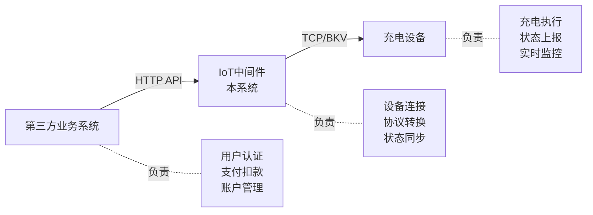

#### ✅ 本系统负责

| 职责模块         | 具体功能                                               | 关键组件                                                 |
| ---------------- | ------------------------------------------------------ | -------------------------------------------------------- |
| **设备连接管理** | TCP 长连接维护、心跳检测、会话管理、在线判定           | `internal/tcpserver/`<br/>`internal/session/`            |
| **协议适配**     | BKV/AP3000 协议解析、指令编码/解码、数据格式转换       | `internal/protocol/bkv/`<br/>`internal/protocol/ap3000/` |
| **状态同步**     | 设备状态维护、订单状态追踪、端口占用管理、充电进度缓存 | `internal/storage/pg/`<br/>`internal/session/`           |
| **指令转发**     | 下行指令队列、ACK 确认机制、超时重试、结果通知         | `internal/outbound/`<br/>`internal/gateway/`             |
| **事件推送**     | 状态变更推送、异常事件通知、充电进度上报               | `internal/thirdparty/`                                   |

#### ❌ 本系统不负责

- ❌ 用户账户管理（第三方负责）
- ❌ 支付与扣款（第三方负责）
- ❌ 资金冻结/退款（第三方负责）
- ❌ 优惠券/活动（第三方负责）
- ❌ 用户界面（第三方负责）
- ❌ 业务规则制定（第三方负责）

> **关键假设**：第三方调用本系统 API 前，已完成用户身份验证、余额检查、预扣款等操作。

### 1.2 系统架构

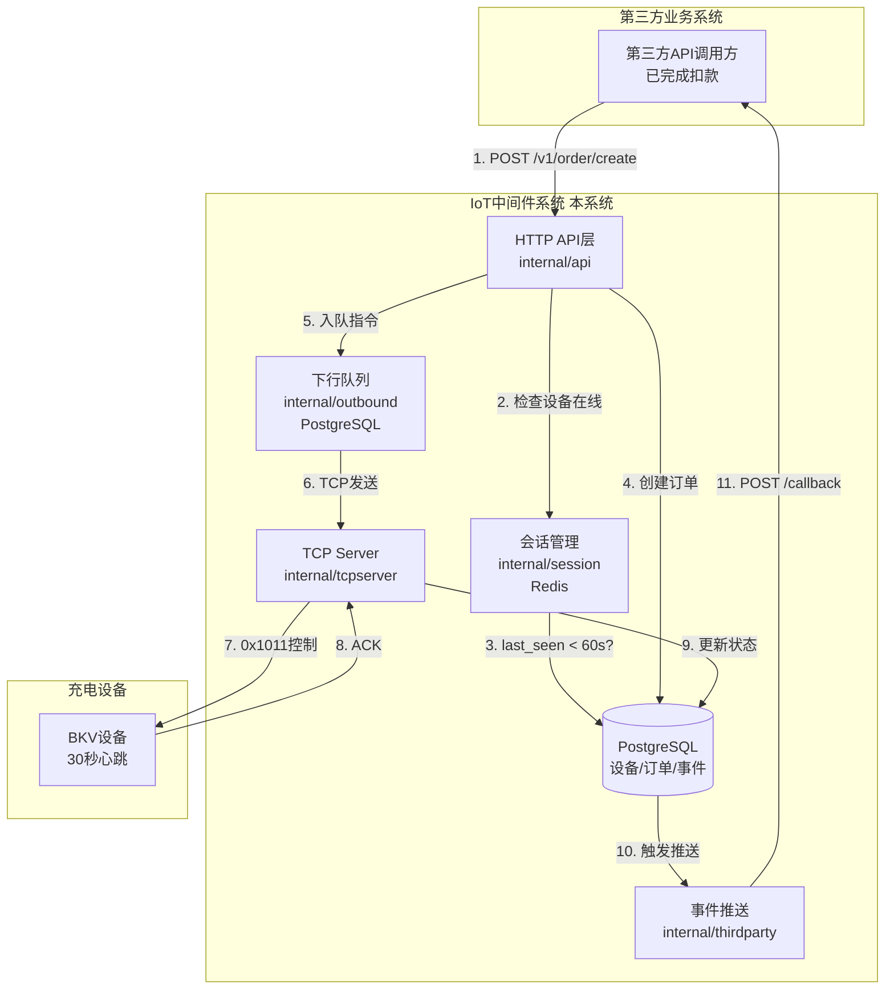

### 1.3 核心原则

#### 🔴 原则 1：设备状态优先（最重要）

> **🚫 设备离线时必须拒绝创建订单**
>
> - 设备不在线 → 指令无法下发 → 订单永久 pending
> - 第三方可能已扣款，但充电无法启动
> - 用户投诉风险高，影响业务体验

**关键实现**：

- 在 `CreateOrder` API 中强制检查设备在线状态
- 判定逻辑：`time.Now() - device.LastSeenAt < 60秒`
- 离线时返回 503 错误，明确提示设备不可用

#### 原则 2：状态一致性

- 本系统维护的设备/订单状态必须与设备实际状态一致
- 所有状态变更必须有设备 ACK 确认
- 延迟 ACK（超过 10 秒）必须被拒绝，防止状态混乱

#### 原则 3：可靠通信

- 指令下发必须有 ACK 确认（`internal/outbound/queue.go`）
- 超时机制防止永久等待（10 秒超时）
- 幂等性支持重试（message_id 去重）

#### 原则 4：可观测性

- 所有关键操作可追踪（`internal/metrics/metrics.go`）
- 异常必须推送到第三方（`internal/thirdparty/pusher.go`）
- 监控指标完整（Prometheus）

---

## 2. 设备状态管理

### 2.1 设备在线判定

**判定逻辑**：

- 设备在线定义：`device.IsOnline = (time.Now() - device.LastSeenAt) < 60秒`
- BKV 协议：设备每 30 秒发送心跳 (0x1007)
- 收到心跳后更新 `last_seen_at` 字段

**关键配置**：
| 参数 | 值 | 说明 |
|-----|---|------|
| 心跳周期 | 30 秒 | BKV 设备心跳间隔 |
| 在线阈值 | 30 秒 | `last_seen_at < 30秒` 视为在线 |
| 推荐阈值 | **60 秒** | 考虑网络延迟，建议设为心跳周期 \* 2 |

**✅ P1-1 已修复 - 心跳超时窗口问题**：

实际心跳周期计算：

- 设备发送间隔：30 秒
- 网络延迟：约 2 秒
- 服务器处理：约 1 秒
- 实际总计：约 33 秒

**已实施方案**：

- ✅ 在线阈值已设为 **60 秒**（心跳周期 × 2）
- ✅ 配置文件：`configs/example.yaml`, `configs/local.yaml`, `configs/production.yaml`
- ✅ 配置项：`session.heartbeat_timeout_sec: 60`
- ✅ 测试验证：`internal/app/session_test.go`
- ✅ 完成日期：2025-11-10

### 2.2 设备连接状态

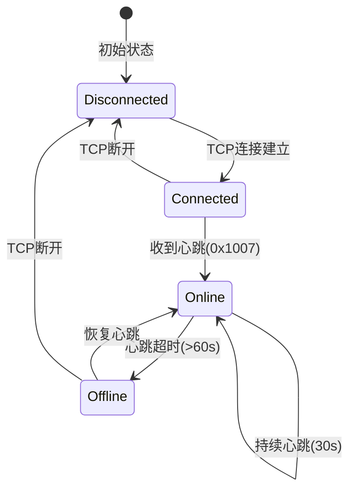

### 2.3 端口状态

每个设备有 1-2 个充电端口：

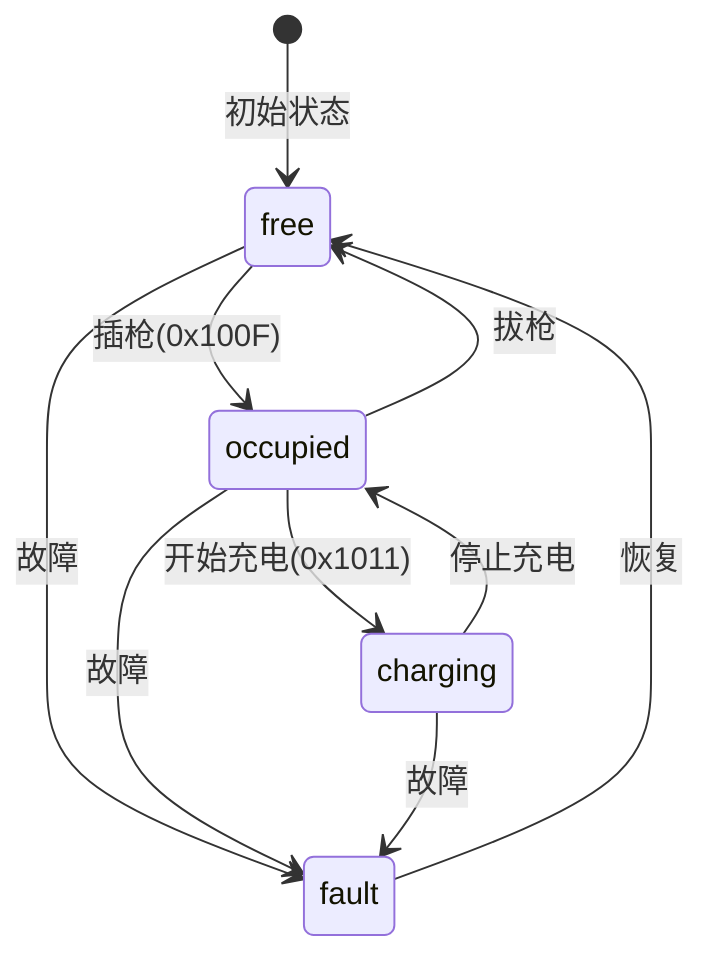

| 状态       | 值  | 含义             | 能否接单 | 数据库字段      |
| ---------- | --- | ---------------- | -------- | --------------- |
| `free`     | 0   | 空闲，无插枪     | ✅ 可以  | `port_status=0` |
| `occupied` | 1   | 有枪插入，未充电 | ✅ 可以  | `port_status=1` |
| `charging` | 2   | 充电中           | ❌ 禁止  | `port_status=2` |
| `fault`    | 3   | 故障             | ❌ 禁止  | `port_status=3` |

**检查逻辑**（`internal/storage/pg/device_repo.go`）：

创建订单前需要进行以下检查：

1. **检查设备在线**：`time.Since(device.LastSeenAt) > 60秒` → 拒绝
2. **检查端口存在**：端口号是否在设备端口列表中
3. **检查端口状态**：
   - `port.Status == "charging"` → 拒绝（端口充电中）
   - `port.Status == "fault"` → 拒绝（端口故障）
4. **检查端口占用**：使用数据库行锁检查是否有活跃订单

---

## 3. 订单生命周期

### 3.1 订单状态机

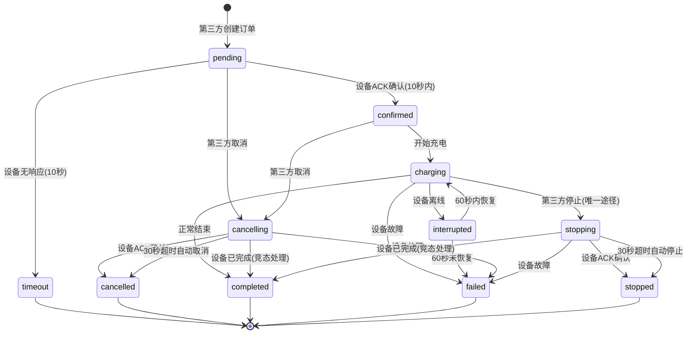

**状态流转说明(v2.2 修正)**:

- **charging 状态禁止直接取消**: 必须先停止充电(stopping),再变为 stopped 终态
- **cancelling/stopping 超时处理**: 30 秒未收到设备 ACK,自动变为 cancelled/stopped(**不是 timeout 状态**)
- **interrupted 恢复条件**: 设备连续 3 次心跳正常且端口状态仍为 charging
- **timeout 状态仅用于 pending**: 订单创建 10 秒内设备未 ACK

````

### 3.2 状态定义

| 状态          | 值  | 含义                 | 能否取消    | 数据库 `status` |
| ------------- | --- | -------------------- | ----------- | --------------- |
| `pending`     | 0   | 等待设备确认         | ✅          | 0               |
| `confirmed`   | 1   | 设备已确认，准备充电 | ✅          | 1               |
| `charging`    | 2   | 正在充电             | ❌ 只能停止 | 2               |
| `completed`   | 3   | 充电完成             | ❌          | 3               |
| `timeout`     | 4   | 设备 10 秒无响应     | ❌          | 4               |
| `cancelled`   | 5   | 已取消               | ❌          | 5               |
| `failed`      | 6   | 充电失败             | ❌          | 6               |
| `stopped`     | 7   | 已停止               | ❌          | 7               |
| `cancelling`  | 8   | 取消中（中间态）     | ❌          | 8               |
| `stopping`    | 9   | 停止中（中间态）     | ❌          | 9               |
| `interrupted` | 10  | 充电中断（临时态）   | ❌          | 10              |

### 3.3 关键时间窗口

| 阶段                | 超时时间   | 行为                                      | 代码位置                             |
| ------------------- | ---------- | ----------------------------------------- | ------------------------------------ |
| **设备在线阈值**    | **60 秒**  | last_seen 超时判定设备离线                | `internal/storage/pg/device_repo.go` |
| pending → confirmed | **10 秒**  | 设备 ACK 超时，自动变为 timeout           | `internal/service/order_monitor.go`  |
| cancelling/stopping | **30 秒**  | 指令 ACK 超时，自动变为 cancelled/stopped | `internal/service/order_monitor.go`  |
| pending 清理        | **5 分钟** | 后台任务清理长期 pending 订单             | `internal/app/order_monitor.go`      |
| outbound 指令       | **30 秒**  | 下行指令发送超时                          | `internal/outbound/queue.go`         |
| TCP write           | **5 秒**   | TCP 写超时                                | `internal/tcpserver/conn.go`         |

**时间阈值说明**:

- **60 秒**: 设备在线判定(基于 BKV 心跳 30 秒+容错 30 秒)
- **10 秒**: pending 订单等待设备确认的最长时间
- **30 秒**: cancelling/stopping 中间态等待设备响应的最长时间

---

## 4. 完整业务流程

### 4.1 下行指令流（第三方 → 设备）

```mermaid
sequenceDiagram
    participant TP as 第三方系统
    participant API as HTTP API
    participant DB as PostgreSQL
    participant Queue as Outbound Queue
    participant TCP as TCP Server
    participant Dev as 充电设备

    TP->>API: POST /v1/order/create<br/>{device_id, port_no, mode}

    Note over API: 关键检查点
    API->>DB: 1. 检查设备是否存在
    API->>DB: 2. 检查设备在线(last_seen<30s)
    API->>DB: 3. 检查端口可用(port_status!=2)
    API->>DB: 4. 检查端口是否有订单(行锁)

    alt 检查失败
        DB-->>API: 设备离线/端口被占用
        API-->>TP: 400/503/409 错误
    else 检查通过
        API->>DB: 创建订单(status=pending)
        DB-->>API: order_no: THD1234567890

        API->>Queue: 入队下行指令<br/>{cmd: 0x1011, order_no}
        API-->>TP: 200 OK<br/>{order_no, status: pending}

        Note over Queue,TCP: 异步处理
        Queue->>TCP: 从队列取指令
        TCP->>Dev: 发送 0x1011 控制指令

        Dev->>TCP: ACK 确认(3秒内)
        TCP->>DB: 更新订单(status=confirmed)
        TCP->>Queue: 标记指令已发送

        Note over DB: 触发事件推送
        DB->>TP: POST /callback<br/>{order_no, status: confirmed}
    end
````

### 4.2 上行状态流（设备 → 第三方）

```mermaid
sequenceDiagram
    participant Dev as 充电设备
    participant TCP as TCP Server
    participant DB as PostgreSQL
    participant Push as Event Pusher
    participant TP as 第三方系统

    loop 每30秒
        Dev->>TCP: 心跳 0x1007
        TCP->>DB: UPDATE devices SET last_seen_at=NOW()
    end

    Dev->>TCP: 端口状态 0x100F<br/>{port_no, status}
    TCP->>DB: UPDATE device_ports SET status=?

    Dev->>TCP: 充电开始事件
    TCP->>DB: UPDATE orders SET status=charging
    DB->>Push: 触发状态变更事件
    Push->>TP: POST /callback<br/>{order_no, status: charging}

    loop 每分钟
        Dev->>TCP: 充电进度<br/>{kwh, remaining_time}
        TCP->>DB: UPDATE orders SET kwh=?, ...
        DB->>Push: 触发进度事件
        Push->>TP: POST /callback<br/>{order_no, kwh, progress}
    end

    Dev->>TCP: 充电结束事件
    TCP->>DB: UPDATE orders SET status=completed
    DB->>Push: 触发完成事件
    Push->>TP: POST /callback<br/>{order_no, status: completed, total_kwh}
```

### 4.3 设备可用性检查流程

```mermaid
flowchart TD
    Start[第三方请求创建订单] --> Check1{设备是否存在?}
    Check1 -->|NO| Error1[404: device not found]
    Check1 -->|YES| Check2{设备是否在线?<br/>online=true}

    Check2 -->|NO| Error2[503: device is offline]
    Check2 -->|YES| Check3{心跳时间?<br/>last_seen < 60s}

    Check3 -->|NO| Error3[503: device heartbeat timeout]
    Check3 -->|YES| Check4{设备状态?<br/>status != fault}

    Check4 -->|NO| Error4[503: device is in fault state]
    Check4 -->|YES| Check5{端口状态?<br/>port_status != charging}

    Check5 -->|NO| Error5[409: port is charging]
    Check5 -->|YES| Check6{端口是否被订单占用?<br/>status IN (0,1,2,8,9,10)<br/>包含中间态}

    Check6 -->|YES| Error6[409: port is occupied]
    Check6 -->|NO| Success[✅ 验证通过<br/>创建订单]

    Error1 --> End
    Error2 --> End
    Error3 --> End
    Error4 --> End
    Error5 --> End
    Error6 --> End
    Success --> End[返回结果]
```

**代码实现位置**：

- `internal/api/thirdparty_handler.go::CreateOrder()`
- `internal/storage/pg/device_repo.go::CanCreateOrder()`

### 4.4 取消订单流程

**适用状态**: `pending`, `confirmed` (**charging 状态不允许直接取消**)

**流程**:

1. 第三方调用取消订单接口
2. 检查订单当前状态
   - 如果是`pending`或`confirmed`: 执行取消流程
   - 如果是`charging`: **拒绝取消请求**,返回错误码`ORDER_IS_CHARGING`,提示必须先停止充电
   - 如果已是终态(`completed`/`cancelled`/`stopped`等): 返回错误"订单已结束"
3. 将订单状态更新为 `cancelling` (中间态)
4. 下发取消指令到设备（0x1011 with cancel flag）
5. 设备 ACK 后，订单变为 `cancelled`
6. 推送取消成功事件到第三方

**超时处理**: 30 秒内未收到 ACK，订单自动变为 `cancelled` (**不是 timeout 状态**)

**charging 状态取消逻辑**:

- 用户必须先调用"停止充电"接口 → `charging`变为`stopping` → 收到 ACK 后变为`stopped`
- `stopped`是终态,无法再流转
- **业务语义区别**:
  - **取消** = 订单未执行前撤销(pending/confirmed 阶段)
  - **停止** = 订单执行中主动终止(charging 阶段)

**代码实现位置**: `internal/api/thirdparty_handler.go::CancelOrder()`

### 4.5 停止充电流程

**适用状态**: `charging`

**流程**:

1. 第三方调用停止充电接口
2. 将订单状态更新为 `stopping` (中间态)
3. 下发停止指令到设备
4. 设备 ACK 后，订单变为 `stopped`
5. 推送停止成功事件到第三方

**超时处理**: 30 秒内未收到 ACK，订单自动变为 `stopped` (**不是 timeout 状态**)

**stopped vs completed 优先级**:

- 如果用户点"停止"的同时设备上报"充电完成",以**设备上报 completed 为准**
- **优先级**: `completed` > `stopped` (设备实际状态优先于用户意图)
- **实现方式**: 在状态更新时检查 timestamp,取最新的事件

**代码实现位置**: `internal/api/thirdparty_handler.go::StopOrder()`

### 4.6 第三方API完整规范

#### 4.6.1 认证机制

**API Key认证**：
```http
X-API-Key: {api_key}
X-Timestamp: {unix_timestamp}
X-Signature: {hmac_sha256_signature}
```

**签名计算**：
```
signature = HMAC_SHA256(
    secret_key,
    "{method}\n{path}\n{timestamp}\n{body}"
)
```

#### 4.6.2 启动充电API

**接口**: `POST /api/v1/third/devices/{device_id}/charge`

**请求示例**:
```json
{
  "port_no": 1,
  "charge_mode": 1,
  "amount": 10000,
  "duration_minutes": 60,
  "price_per_kwh": 150,
  "service_fee": 100
}
```

**成功响应(200)**:
```json
{
  "code": 0,
  "message": "success",
  "data": {
    "order_no": "THD1234567890",
    "status": "pending",
    "device_id": "82241218000382",
    "port_no": 1
  },
  "request_id": "req_xxx",
  "timestamp": 1704528000
}
```

**错误响应**:
| HTTP状态码 | 业务错误码 | 说明 |
|-----------|-----------|------|
| 400 | 40001 | 参数错误 |
| 403 | 40301 | 签名验证失败 |
| 404 | 40401 | 设备不存在 |
| 404 | 40402 | 端口不存在 |
| 409 | 40901 | 端口被占用 |
| 503 | 50301 | 设备离线 |
| 503 | 50302 | 设备心跳超时 |
| 503 | 50303 | 设备故障 |

#### 4.6.3 停止充电API

**接口**: `POST /api/v1/third/orders/{order_no}/stop`

**请求体**: `{}` (空对象)

**成功响应(200)**:
```json
{
  "code": 0,
  "message": "success",
  "data": {
    "order_no": "THD1234567890",
    "status": "stopping",
    "old_status": "charging"
  },
  "request_id": "req_xxx",
  "timestamp": 1704528000
}
```

#### 4.6.4 取消订单API

**接口**: `POST /api/v1/third/orders/{order_no}/cancel`

**请求体**: `{}` (空对象)

**成功响应(200)**:
```json
{
  "code": 0,
  "message": "success",
  "data": {
    "order_no": "THD1234567890",
    "status": "cancelling",
    "old_status": "pending"
  },
  "request_id": "req_xxx",
  "timestamp": 1704528000
}
```

**错误响应**:
| HTTP状态码 | 业务错误码 | 说明 |
|-----------|-----------|------|
| 400 | 40002 | 订单不可取消（charging状态需先停止） |
| 404 | 40403 | 订单不存在 |
| 409 | 40902 | 订单已结束 |

#### 4.6.5 查询订单API

**接口**: `GET /api/v1/third/orders/{order_no}`

**成功响应(200)**:
```json
{
  "code": 0,
  "message": "success",
  "data": {
    "order_no": "THD1234567890",
    "device_id": "82241218000382",
    "port_no": 1,
    "status": 2,
    "status_text": "charging",
    "start_time": "2025-01-06T10:00:00Z",
    "end_time": null,
    "kwh": 1.234,
    "amount_cent": 10000,
    "duration_seconds": 1800
  },
  "request_id": "req_xxx",
  "timestamp": 1704528000
}
```

#### 4.6.6 Webhook回调接口

第三方需提供Webhook URL接收事件推送。

**接口**: `POST {third_party_webhook_url}/callback`

**请求头**:
```http
Content-Type: application/json
X-Event-Type: {event_type}
X-Event-ID: {event_id}
X-Timestamp: {timestamp}
X-Signature: {hmac_sha256_signature}
```

**请求体示例(订单状态变更)**:
```json
{
  "event_id": "order.confirmed-82241218000382-1704528000123456789",
  "event_type": "order.confirmed",
  "device_phy_id": "82241218000382",
  "timestamp": 1704528000,
  "nonce": "abc12345",
  "data": {
    "order_no": "THD1234567890",
    "device_id": "82241218000382",
    "port_no": 1,
    "old_status": "pending",
    "new_status": "confirmed"
  }
}
```

**事件类型清单**:
| 事件类型 | 说明 | 触发时机 |
|---------|------|---------|
| `device.registered` | 设备注册 | 设备首次连接 |
| `device.heartbeat` | 设备心跳 | 每30秒 |
| `order.created` | 订单创建 | 第三方创建订单 |
| `order.confirmed` | 订单确认 | 设备ACK确认 |
| `order.timeout` | 订单超时 | pending状态10秒无响应 |
| `charging.started` | 充电开始 | 订单变为charging |
| `charging.progress` | 充电进度 | 每分钟上报 |
| `charging.ended` | 充电结束 | 充电完成 |
| `order.completed` | 订单完成 | 设备上报完成 |
| `order.stopped` | 订单停止 | 用户主动停止 |
| `order.cancelled` | 订单取消 | 用户主动取消 |
| `order.failed` | 订单失败 | 设备故障/断线 |
| `device.offline` | 设备离线 | 心跳超时60秒 |
| `device.alarm` | 设备告警 | 设备上报故障 |

**第三方响应要求**:
```json
{
  "code": 0,
  "message": "success"
}
```

- HTTP状态码200视为成功
- 非200状态码将触发重试（最多5次）
- 超时时间：5秒

### 4.7 BKV协议详细规范

#### 4.7.1 帧格式定义

**基本帧结构**:
```
[起始标志] [数据长度] [数据域] [校验和]
  2 Byte    2 Byte     N Byte    可选
```

**完整帧示例**:
```
FC FE 00 10 10 11 AB CD 12 34 56 78 01 02 03 04 05 06 07 08 ...
│  │  │  │  │  │  │  │  │  │  │  │  └─────────┬─────────────┘
│  │  │  │  │  │  │  │  │  │  │  │            └─ 数据域(N字节)
│  │  │  │  │  │  │  │  └──┴──┴──┴─ 网关ID(4字节)
│  │  │  │  │  │  └──┴─ 消息ID(2字节)
│  │  │  │  └──┴─ 命令码(2字节)
│  │  └──┴─ 数据长度(2字节,大端序)
└──┴─ 起始标志(0xFC 0xFE或0xFC 0xFF)
```

#### 4.7.2 关键命令定义

**0x0000 - 心跳帧**
- **方向**: 设备 → 平台
- **周期**: 30秒
- **数据域**: 空或状态信息
- **用途**: 维持连接，更新last_seen_at

**0x1004 - 网络节点帧**
- **方向**: 设备 → 平台
- **触发**: 设备上线/重连
- **数据域**: 设备信息（ICCID, IMEI, 固件版本等）
- **用途**: 设备注册

**0x100F - 端口状态上报**
- **方向**: 设备 → 平台
- **触发**: 端口状态变化
- **数据域**:
  ```
  [端口号(1B)] [状态(1B)] [功率(2B)] ...
  状态: 0=free, 1=occupied, 2=charging, 3=fault
  ```

**0x1010 - 刷卡充电上报**
- **方向**: 设备 → 平台
- **触发**: 用户刷卡
- **数据域**:
  ```
  [卡号(8B)] [端口号(1B)] [余额(4B)] ...
  ```

**0x1011 - 控制指令**
- **方向**: 平台 → 设备
- **用途**: 启动/停止充电
- **数据域**:
  ```
  [操作类型(1B)] [端口号(1B)] [参数...]
  操作类型: 0x01=启动, 0x02=停止
  ```

**0x1012 - 查询端口状态**
- **方向**: 平台 → 设备
- **用途**: 实时查询端口状态（P1-4需要）
- **数据域**: `[端口号(1B)]`
- **响应**: 通过0x100F上报

**0x0F - ACK确认帧**
- **方向**: 设备 → 平台
- **触发**: 响应下行指令
- **数据域**:
  ```
  [原消息ID(2B)] [结果码(1B)] [错误码(2B)]
  结果码: 0x00=成功, 0x01=失败
  ```

#### 4.7.3 设备连接流程

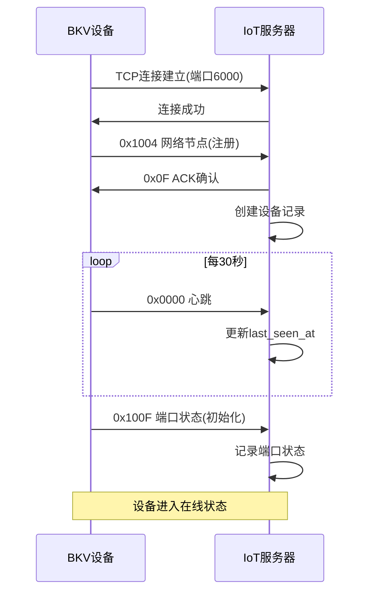

#### 4.7.4 充电控制流程

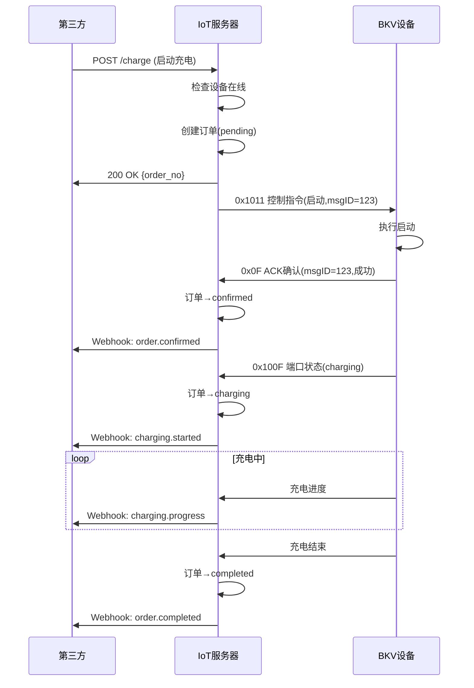

#### 4.7.5 错误码定义

| 错误码 | 十六进制 | 说明 |
|-------|---------|------|
| 0x0000 | 0x00 0x00 | 成功 |
| 0x0001 | 0x00 0x01 | 参数错误 |
| 0x0002 | 0x00 0x02 | 端口不存在 |
| 0x0003 | 0x00 0x03 | 端口被占用 |
| 0x0004 | 0x00 0x04 | 端口故障 |
| 0x0005 | 0x00 0x05 | 充电失败 |
| 0x00FF | 0x00 0xFF | 未知错误 |

---

## 5. 异常场景处理

### 5.1 场景 1：设备离线时创建订单

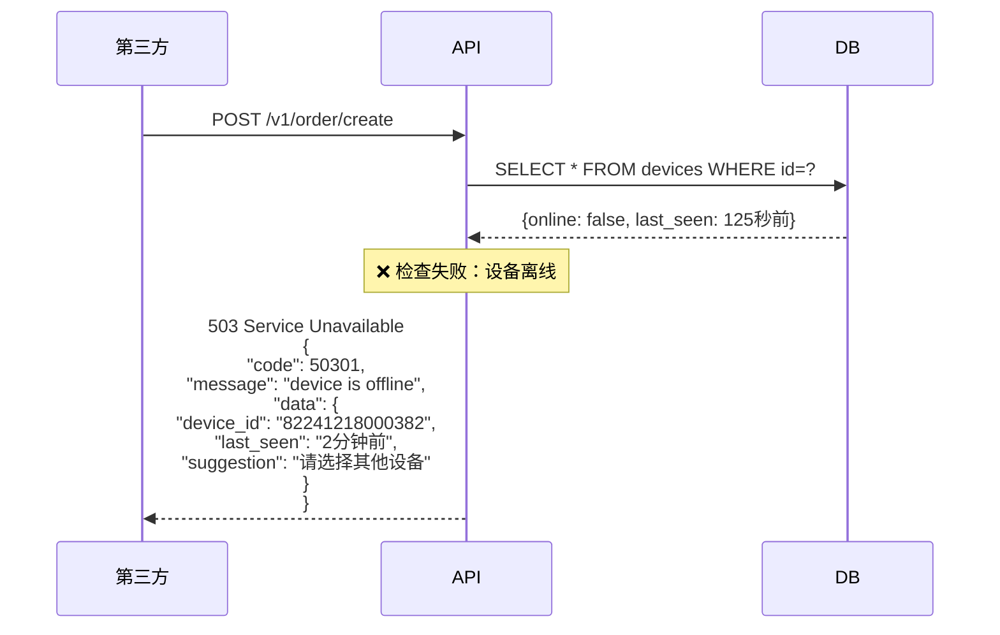

**关键**：

- ✅ 不创建订单
- ✅ 不占用端口
- ✅ 明确提示用户
- ✅ 避免第三方已扣款但无法充电的情况

### 5.2 场景 2：设备在充电中突然离线

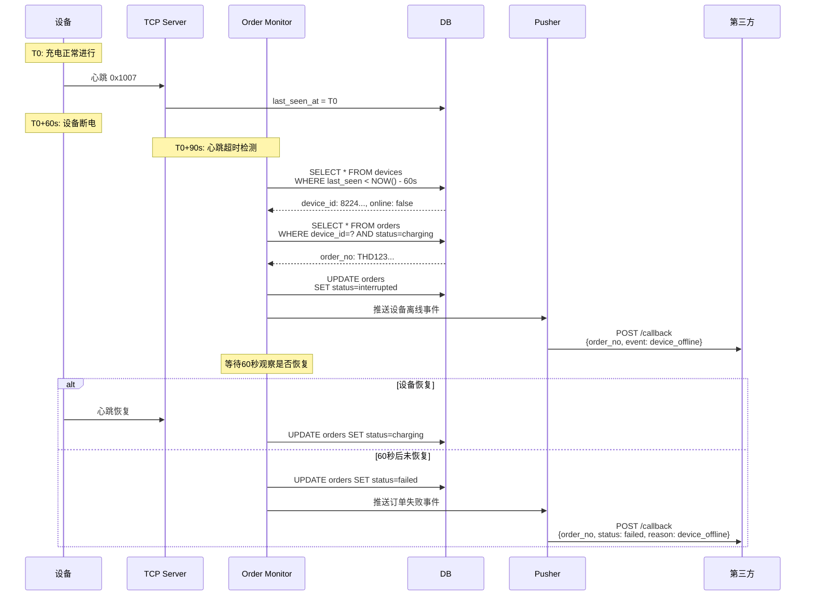

**关键**：

- ✅ 检测到设备离线立即通知第三方
- ✅ 等待 60 秒观察是否恢复
- ✅ 第三方根据事件决定是否停止计费

### 5.3 场景 3：指令下发后设备无响应

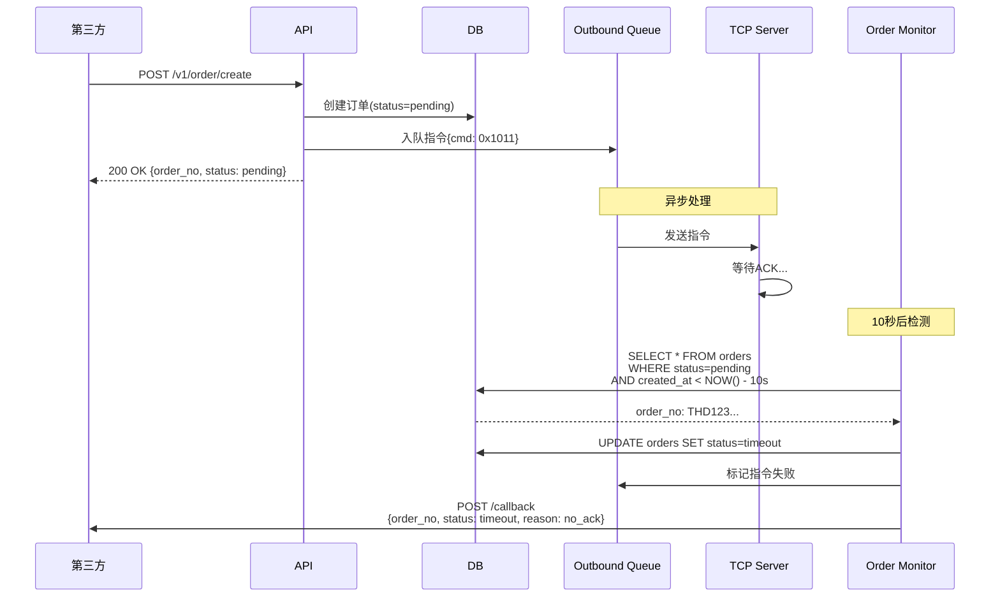

**关键**：

- ✅ pending 状态最多保持 10 秒
- ✅ 超时自动变为 timeout
- ✅ 第三方收到超时事件后可自行决定是否退款

### 5.4 场景 4：端口并发冲突

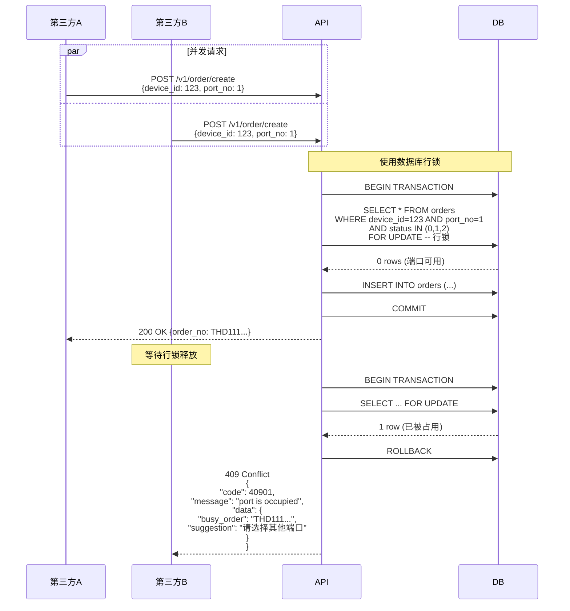

**关键**：

- ✅ 使用数据库行锁（`FOR UPDATE`）
- ✅ 防止并发创建订单
- ✅ 明确告知哪个订单占用了端口

---

## 6. 关键检查点与逻辑漏洞修复

### 6.0 逻辑漏洞总览

**已识别漏洞统计**：

| 优先级   | 数量   | 漏洞列表                                         | 核心影响             |
| -------- | ------ | ------------------------------------------------ | -------------------- |
| 🔴 P0    | 2      | P0-1(设备离线检查), P0-2(断线恢复)               | 资金损失、用户投诉   |
| 🟡 P1    | 6      | P1-1(心跳窗口), P1-2(延迟 ACK), P1-3(端口并发)   | 状态不一致、计费错误 |
|          |        | P1-4(端口同步), P1-5(取消竞态), P1-6(队列优先级) |                      |
|          |        | P1-7(事件推送)                                   |                      |
| 🟢 P2    | 3      | P2-1(监控竞态), P2-2(会话管理), P2-3(并发性能)   | 性能问题、系统稳定性 |
| **总计** | **11** | -                                                | -                    |

**修复优先级建议**：

1. **立即修复（本周内）**：

   - 🔴 P0-1: 设备离线检查（防止资金损失）
   - 🔴 P0-2: 断线恢复逻辑（防止误计费）
   - 🟡 P1-7: 事件推送一致性（防止计费错误）

2. **近期修复（2 周内）**：

   - 🟡 P1-4: 端口状态同步
   - 🟡 P1-5: 取消/停止竞态
   - 🟡 P1-6: 队列优先级

3. **持续优化（1 个月内）**：
   - 🟡 P1-1, P1-2, P1-3（已有部分实现）
   - 🟢 P2-1, P2-2, P2-3（性能和稳定性）

---

### 6.1 创建订单前检查清单

| 序号 | 检查项       | 验证方式                                   | 失败响应                      | 代码位置                              |
| ---- | ------------ | ------------------------------------------ | ----------------------------- | ------------------------------------- |
| 1    | 设备存在性   | `SELECT * FROM devices WHERE id=?`         | 404: device not found         | `device_repo.go::GetByID`             |
| 2    | 设备在线状态 | `device.online = true`                     | 503: device is offline        | `device_repo.go::IsOnline`            |
| 3    | 心跳时间     | `NOW() - last_seen_at < 60s`               | 503: device heartbeat timeout | `device_repo.go::IsOnline`            |
| 4    | 设备工作状态 | `device.status != 'fault'`                 | 503: device is in fault state | `device_repo.go::CanCreateOrder`      |
| 5    | 端口存在性   | `port_no IN (1,2,...)`                     | 404: port not found           | `device_repo.go::GetPort`             |
| 6    | 端口状态     | `port.status NOT IN ('charging', 'fault')` | 409: port is busy/fault       | `device_repo.go::CanCreateOrder`      |
| 7    | 端口占用检查 | `SELECT ... FOR UPDATE`                    | 409: port is occupied         | `order_repo.go::GetActiveOrderByPort` |

**🔴 P0 修复 - 设备离线检查**：

实现要点：

1. 在 `CreateOrder` API 入口强制检查设备在线状态
2. 判定逻辑：`time.Since(device.LastSeenAt) > 60秒` → 拒绝
3. 返回 HTTP 503 错误码和详细离线信息
4. 日志记录：记录设备 ID、离线时长、最后心跳时间
5. 响应数据包含：设备 ID、离线时长、建议操作

代码位置：`internal/api/thirdparty_handler.go::CreateOrder()`

### 6.2 已识别逻辑漏洞与修复方案

#### 🔴 P0-1: 设备离线仍可创建订单

**问题描述**：

- 当前代码未在创建订单前检查设备在线状态
- 可能导致离线设备接受订单，但无法执行充电

**修复方案**：

- 在 `CreateOrder` 前强制检查设备在线
- 阈值建议设为 60 秒（心跳周期 × 2）
- 离线时返回 503 错误

代码位置：`internal/api/thirdparty_handler.go::CreateOrder()`

---

#### ✅ P1-1: 心跳超时窗口问题（已修复）

**问题描述**：

- 设备心跳周期：30 秒
- 实际传输时间：30s + 网络延迟 2s + 处理 1s = 33 秒
- 在线阈值：30 秒 → 误判离线

**✅ 已实施方案**：

- ✅ 配置文件修改：`session.heartbeat_timeout_sec = 60`（心跳周期 × 2）
- ✅ 更新位置：`configs/example.yaml`, `configs/local.yaml`, `configs/production.yaml`
- ✅ 测试验证：`internal/app/session_test.go`
- ✅ 完成日期：2025-11-10

---

#### ✅ P1-2: 延迟 ACK 导致状态混乱（已修复）

**问题场景**：

- T0：订单 A 创建，下发启动指令
- T10：订单 A 超时，标记为 timeout
- T15：设备发送订单 A 的 ACK（延迟 15 秒）
- 结果：系统错误地将订单 A 变为 confirmed，但端口实际已被订单 B 占用

**✅ 已实施方案**：

1. ✅ ACK 处理时检查订单状态必须为 `pending`
2. ✅ 检查 ACK 时效性：创建时间超过 10 秒拒绝处理
3. ✅ 拒绝延迟 ACK 并记录告警日志
4. ✅ 实现位置：`internal/service/card_service.go::HandleOrderConfirmation()`
5. ✅ 测试验证：`internal/service/card_service_test.go`（5个测试场景）
6. ✅ 完成日期：2025-11-10

---

#### ✅ P1-3: 端口并发冲突（已修复）

**问题描述**：

- 当前代码先检查端口状态，再创建订单
- 竞态条件：两个请求可能同时通过检查
- 结果：同一端口可能被两个订单同时占用

**✅ 已实施方案(v2.2 版本完善)**：

1. **✅ 使用数据库行锁,同时锁 orders 和 device_ports 表**：

   ```sql
   BEGIN;
   -- 锁住该端口的所有活跃订单(包含中间态)
   SELECT * FROM orders
   WHERE device_id = ? AND port_no = ?
     AND status IN (0, 1, 2, 8, 9, 10)  -- pending, confirmed, charging, cancelling, stopping, interrupted
   FOR UPDATE;

   -- 同时锁定device_ports表,防止端口状态被其他事务修改
   SELECT * FROM device_ports
   WHERE device_id = ? AND port_no = ?
   FOR UPDATE;

   -- 检查是否有订单存在
   IF EXISTS(...) THEN
       ROLLBACK;
       RETURN "端口占用";
   END IF;

   -- 创建新订单
   INSERT INTO orders (...) VALUES (...);

   -- 更新device_ports表
   UPDATE device_ports SET status='occupied', current_order_no=?
   WHERE device_id=? AND port_no=?;

   COMMIT;
   ```

   **关键改进(v2.2)**:

   - ✅ 端口占用检查必须包含中间态(8,9,10)
   - ✅ 同时锁定 orders 和 device_ports 两张表,避免跨表不一致

2. ✅ 在同一事务中完成检查和创建
3. ✅ WHERE 条件：`status IN (0,1,2,8,9,10)` 确保锁定所有活跃订单(包含中间态)
4. ✅ 实现位置：`internal/api/thirdparty_handler.go`（196-350行）
5. ✅ 完成日期：2025-11-10

---

#### 🟢 P2-1: 订单监控任务竞态

**问题描述**：

- 后台任务每 30 秒扫描超时订单
- 查询后逐条更新状态
- 竞态：设备 ACK 可能在查询和更新之间到达

**修复方案**：

1. 使用 CAS（Compare-And-Set）原子更新
2. 单条 SQL 完成查询+更新
3. WHERE 条件中再次确认状态，防止竞态

代码位置：`internal/service/order_monitor.go::MonitorPendingOrders()`

---

#### 🔴 P0-2: 充电中订单的设备断线恢复逻辑不完整

**问题描述**：

- 设备离线后等待 60 秒观察恢复，但恢复后的处理逻辑缺失
- 设备恢复时，端口状态可能已变化（拔枪/故障/被其他用户占用）
- 设备状态与数据库状态可能不一致

**风险场景**：

```
T0:  订单charging，用户正常充电
T30: 设备断电离线
T45: 用户拔枪离开
T50: 设备恢复上线，端口状态=free，但系统订单仍为charging
结果: 系统继续计费，但实际已无人充电
```

**修复方案(v2.2 版本完善)**：

1. **引入 `interrupted` 中间态**：

   - 当 `charging` 订单的设备离线时 → 订单状态变为 `interrupted`
   - 设备恢复后，订单自动流转回 `charging`
   - 如果 60 秒内未恢复，订单标记为 `failed`

2. **状态流转逻辑**：

   ```
   charging → interrupted (设备离线,last_seen > 60s)
   interrupted → charging (设备恢复,60秒内)
   interrupted → failed (超时未恢复,60秒后)
   ```

3. **恢复检测逻辑(v2.2 补充)**：

   ```go
   func OnDeviceHeartbeat(deviceID string) {
       // 更新设备在线状态
       db.UpdateDeviceLastSeen(deviceID)

       // 检查是否有interrupted订单需要恢复
       interruptedOrders := db.Query(`
           SELECT order_no, port_no FROM orders
           WHERE device_id=? AND status=10  -- interrupted
       `)

       for _, order := range interruptedOrders {
           // 检查端口状态是否仍为charging
           portStatus := GetPortStatus(deviceID, order.PortNo)
           if portStatus == "charging" {
               // 连续3次心跳确认恢复
               if CheckContinuousHeartbeat(deviceID, 3) {
                   db.UpdateOrder(order.OrderNo, charging)  // 恢复为charging
                   PushEvent("order_resumed", order.OrderNo)
               }
           } else {
               // 端口已不在充电,标记订单失败
               db.UpdateOrder(order.OrderNo, failed)
               PushEvent("order_failed", order.OrderNo, "port_state_mismatch")
           }
       }
   }
   ```

4. **监控任务补充**:

   ```go
   // 检查超时未恢复的interrupted订单
   func CheckInterruptedOrders() {
       db.Exec(`
           UPDATE orders SET status=6  -- failed
           WHERE status=10 AND updated_at < NOW() - INTERVAL '60 seconds'
       `)
   }
   ```

5. 设备恢复后必须立即查询端口实时状态（下发 0x1012 查询命令）
6. 对比端口状态与订单状态：
   - 端口状态不为 charging 时强制结束订单
   - 更新订单为 failed，标注原因：port_state_mismatch
7. 推送"异常结束"事件给第三方，包含实际充电时长
8. 记录详细日志：离线时长、恢复时间、端口状态变化

**关键改进(v2.2)**:

- 明确恢复检测条件:连续 3 次心跳+端口状态=charging
- 恢复后无需重发指令(设备侧订单仍在执行)
- 60 秒窗口内多次断线,重新计时

代码位置：`internal/service/order_monitor.go::HandleDeviceReconnect()`

---

#### ✅ P1-4: 端口状态与订单状态不同步（已修复）

**问题描述**：

- 端口状态由设备上报（0x100F），订单状态由系统维护
- 两者更新时序不同步，可能出现状态错配

**风险场景**：

```
场景1: 端口锁死
- 订单timeout，但停止指令未送达设备
- 设备端口仍为charging，系统认为free
- 后续订单无法创建（端口实际被占用）

场景2: 双重下单
- 设备主动停止充电（故障/用户拔枪），端口→free
- 停止事件丢失，系统订单仍为charging
- 新订单创建成功（系统未感知端口已free）
```

**✅ 已实施方案**：

1. ✅ **定期状态同步任务**（每 5 分钟）：
   - 查询所有在线设备的全部端口状态（0x1012）
   - 对比数据库状态，发现差异时自动修复
2. ✅ **状态不一致告警与恢复**：
   - Prometheus 指标：`port_state_mismatch_total`
   - 记录详细日志
   - 自动恢复机制
3. ✅ 实现位置：`internal/app/port_status_syncer.go`（312行）
4. ✅ 测试验证：`internal/app/port_status_syncer_test.go`（2个测试场景）
5. ✅ 后台任务：已启用
6. ✅ 完成日期：2025-11-10

---

#### ✅ P1-5: 订单取消/停止的时序窗口漏洞（已修复）

**问题描述**：

- 取消/停止请求与设备 ACK/状态变更之间存在竞态
- 缺少指令幂等性设计和中间态管理

**风险场景**：

```
T0: 订单pending，下发启动指令
T1: 用户取消订单
T2: 设备ACK到达，订单→confirmed
T3: 取消请求处理，但状态已非pending，取消失败
T4: 设备开始充电，用户已离开
```

**✅ 已实施方案**：

1. ✅ **引入中间态**：
   - `cancelling`(状态 8)：取消中
   - `stopping`(状态 9)：停止中
2. ✅ **取消/停止流程改造**：
   - 使用CAS更新：WHERE status IN (0,1) SET status=8 (cancelling)
   - 下发取消指令到设备（0x1013）
   - 设备ACK确认 → 更新为cancelled(5)
3. ✅ **处理 ACK 时的状态检查**：
   - 启动指令ACK时检查订单状态
   - 如果status==cancelling则拒绝启动
4. ✅ **超时保护**：
   - cancelling/stopping 超过 30 秒未收到 ACK
   - OrderMonitor自动清理，强制标记为 cancelled/stopped
5. ✅ 实现位置：
   - `internal/api/thirdparty_handler.go::CancelOrder()`
   - `internal/app/order_monitor.go`
6. ✅ 完成日期：2025-11-10

---

#### ✅ P1-6: 下行队列缺少优先级和死信队列（已修复）

**问题描述**：

- 所有指令 FIFO 处理，无优先级区分
- 指令失败后的重试和清理策略缺失
- 队列堆积时缺少降级策略

**风险场景**：

```
场景1: 紧急指令延迟
- 队列中有100条查询指令排队
- 用户发起紧急停止充电请求
- 停止指令排队等待，延迟1分钟执行
- 用户多计费

场景2: 队列堆积
- 设备大面积离线，指令积压
- 队列长度>1000，新指令入队失败
- 在线设备也无法接收指令
```

**✅ 已实施方案**：

1. ✅ **指令优先级分级**（5级）：
   - Emergency(1): 停止充电、取消订单
   - High(2): 启动充电、查询端口
   - Normal(3): 参数设置、查询信息
   - Low(4): OTA升级
   - Background(5): 定期同步
2. ✅ **死信队列机制**：
   - DeadLetterCleaner每小时清理超过24小时的死信
   - 标记失败原因和重试次数
3. ✅ **降级策略**：
   - 队列长度>200：拒绝低优先级(>5)
   - 队列长度>500：拒绝中优先级(>2)
   - 队列长度>1000：仅接受紧急指令(≤1)
4. ✅ 实现位置：
   - `internal/outbound/priority.go` - 优先级定义
   - `internal/app/dead_letter_cleaner.go` - 死信清理
   - `internal/storage/redis/outbound_queue.go` - 队列过载保护
5. ✅ 测试验证：`internal/outbound/priority_test.go`
6. ✅ 完成日期：2025-11-10

---

#### ✅ P1-7: 事件推送失败的数据一致性问题（已修复）

**问题描述**：

- 订单状态更新与事件推送不是原子操作
- 推送失败时缺少重试和兜底机制
- 事件可能乱序到达第三方

**风险场景**：

```
T0: 订单completed，数据库已更新
T1: 推送completed事件到第三方
T2: 第三方服务宕机，推送失败
T3: 系统无重试，第三方永远收不到完成事件
结果: 第三方认为订单仍在charging，继续计费
```

**✅ 已实施方案**：

1. ✅ **引入 Outbox 模式**：
   - Events表存储事件（序列号、重试、状态）
   - 数据库迁移：`db/migrations/012_events_outbox.sql`
2. ✅ **订单状态更新与事件写入在同一事务**：
   - CardService使用事务版本的更新方法
   - UpdateTransactionChargingWithEvent等方法
3. ✅ **后台事件推送任务**（每 10 秒）：
   - EventPusher定期批量推送
   - 推送成功/失败状态跟踪
   - 重试机制（最多5次）
4. ✅ **事件序列号保证顺序**：
   - 每个订单的事件携带递增序列号
   - 按序推送确保顺序一致性
5. ✅ **提供 HTTP 查询接口兜底**：
   - `GET /api/v1/third/orders/:order_id/events`
   - 第三方可主动查询补偿
6. ✅ **推送失败告警**：
   - 完整的错误跟踪和日志
7. ✅ 实现位置：
   - `internal/app/event_pusher.go` - 后台推送器
   - `internal/service/card_service.go` - 事务写入
   - `internal/api/thirdparty_handler.go` - 查询接口
8. ✅ 后台任务：已启用
9. ✅ 完成日期：2025-11-10

---

#### 🟢 P2-2: 设备重连后的会话状态不一致

**问题描述**：

- TCP 断开重连后，旧会话中的订单上下文可能丢失
- 多实例部署时会话状态无法跨实例同步
- 缺少会话过期和清理机制

**风险场景**：

```
场景1: 单实例重连
- 设备TCP断开，订单仍为charging
- 设备重连，建立新会话
- 旧会话中的pending指令丢失

场景2: 多实例重连
- 设备从实例A断开（订单在A的内存中）
- 设备重连到实例B
- 实例B无法感知该设备的订单状态
```

**修复方案**：

1. **会话状态持久化到 Redis**：

   ```redis
   # Key: session:{device_id}
   {
       "device_id": "82241218000382",
       "instance_id": "server-01",
       "conn_id": "tcp-12345",
       "connected_at": 1699000000,
       "active_orders": ["THD123", "THD456"],
       "pending_commands": [
           {"msg_id": "msg001", "cmd": "0x1011", "order_no": "THD123"}
       ]
   }
   # TTL: 300秒（5分钟）
   ```

2. **设备连接时加载会话状态**：

   ```go
   func OnDeviceConnect(deviceID string) {
       // 从Redis加载旧会话
       session := redis.Get("session:" + deviceID)

       if session != nil {
           // 检查active_orders状态
           for _, orderNo := range session.ActiveOrders {
               order := db.GetOrder(orderNo)
               if order.Status == charging && device offline > 5min {
                   // 设备长时间离线，订单失败
                   db.UpdateOrder(orderNo, failed)
               }
           }

           // 恢复pending_commands到下行队列
           for _, cmd := range session.PendingCommands {
               if time.Since(cmd.CreatedAt) < 30s {
                   queue.Enqueue(cmd)
               }
           }
       }

       // 创建新会话
       CreateSession(deviceID, instanceID, connID)
   }
   ```

3. **会话过期策略**：
   - 设备离线 5 分钟后 Redis 会话自动过期
   - 过期时触发回调：检查该设备的 charging 订单
   - 所有 charging 订单标记为 failed（原因：session_expired）
4. **会话心跳更新**：

   - 设备每次发送心跳时更新 Redis 会话 TTL
   - 确保在线设备的会话不会过期

5. **跨实例会话迁移**：
   - 设备重连到新实例时，更新 Redis 中的 instance_id
   - 新实例接管订单和指令队列
   - 旧实例通过 Redis pub/sub 感知迁移，清理本地资源

代码位置：

- `internal/session/manager.go::LoadSession()` - 加载会话
- `internal/session/manager.go::PersistSession()` - 持久化会话
- `internal/tcpserver/handler.go::OnConnect()` - 连接处理

---

#### 🟢 P2-3: 高并发场景下的性能和死锁风险

**问题描述**：

- 使用 FOR UPDATE 行锁，锁范围过大，降低并发能力
- 长事务增加死锁概率
- 缺少必要的数据库索引，查询性能差

**风险场景**：

```
死锁场景:
- 事务A: UPDATE orders WHERE id=1 (持有订单1行锁)
- 事务B: UPDATE orders WHERE id=2 (持有订单2行锁)
- 监控任务: SELECT * FROM orders WHERE status=0 FOR UPDATE (等待全表锁)
- 事务A: 查询设备表(等待监控任务释放)
结果: 死锁
```

**修复方案**：

1. **缩小锁粒度**：

   ```go
   // 错误做法：锁整行
   SELECT * FROM orders WHERE device_id=? AND port_no=? FOR UPDATE

   // 正确做法：只锁必要字段，或使用乐观锁
   SELECT id, status, version FROM orders
   WHERE device_id=? AND port_no=? AND status IN (0,1,2)
   FOR UPDATE SKIP LOCKED  -- 跳过已锁行
   ```

2. **使用乐观锁替代悲观锁**：

   ```sql
   -- 增加version字段
   ALTER TABLE orders ADD COLUMN version INT DEFAULT 0;

   -- 更新时使用CAS
   UPDATE orders
   SET status=?, version=version+1
   WHERE order_no=? AND version=?
   -- 影响行数=0表示冲突，需要重试
   ```

3. **拆分事务，减少长事务**：

   ```go
   // 错误做法：在一个事务中完成所有操作
   tx.Begin()
   tx.CheckDevice()
   tx.CheckPort()
   tx.CreateOrder()
   tx.EnqueueCommand()  // 可能耗时长
   tx.Commit()

   // 正确做法：拆分为多个短事务
   tx1: 检查+创建订单（快速）
   异步: 入队指令（解耦）
   tx2: 指令发送完成后更新状态
   ```

4. **添加数据库索引**：

   ```sql
   -- 端口占用检查优化
   CREATE INDEX idx_orders_device_port_status
   ON orders(device_id, port_no, status);

   -- 订单监控查询优化
   CREATE INDEX idx_orders_status_created
   ON orders(status, created_at);

   -- 设备在线检查优化
   CREATE INDEX idx_devices_last_seen
   ON devices(last_seen_at);

   -- 充电订单查询优化
   CREATE INDEX idx_orders_device_status
   ON orders(device_id, status)
   WHERE status IN (0,1,2);  -- 部分索引
   ```

5. **使用分布式锁优化高频操作**：

   ```go
   // 创建订单前获取分布式锁
   lockKey := fmt.Sprintf("lock:device:%s:port:%d", deviceID, portNo)
   lock := redis.Lock(lockKey, 5*time.Second)

   if lock.Acquire() {
       defer lock.Release()
       // 检查+创建订单
   } else {
       return ErrPortBusy
   }
   ```

6. **监控任务查询优化**：

   ```go
   // 错误做法：全表扫描+逐条更新
   orders := SELECT * FROM orders WHERE status=0
   for order in orders {
       UPDATE orders SET status=4 WHERE id=?
   }

   // 正确做法：单条SQL批量更新
   UPDATE orders SET status=4
   WHERE status=0 AND created_at < NOW() - INTERVAL '10 seconds'
   RETURNING order_no  -- 返回受影响的订单号
   ```

7. **连接池配置优化**：

   ```yaml
   database:
     max_open_conns: 50 # 最大连接数
     max_idle_conns: 10 # 最大空闲连接
     conn_max_lifetime: 30m # 连接最大生命周期
     conn_max_idle_time: 5m # 连接最大空闲时间
   ```

8. **性能监控指标**：
   ```
   - db_query_duration_seconds{query="create_order"}
   - db_lock_wait_seconds
   - db_deadlock_total
   - db_active_connections
   ```

代码位置：

- `internal/storage/pg/order_repo.go::CreateOrder()` - 优化锁
- `internal/service/order_monitor.go::MonitorPendingOrders()` - 批量更新
- `configs/example.yaml` - 连接池配置

---

### 6.3 状态流转合法性矩阵

| FROM ↓ / TO →   | pending | confirmed | charging | completed | timeout | cancelled | failed | stopped | cancelling | stopping | interrupted |
| --------------- | ------- | --------- | -------- | --------- | ------- | --------- | ------ | ------- | ---------- | -------- | ----------- |
| **pending**     | -       | ✅        | ❌       | ❌        | ✅      | ❌        | ❌     | ❌      | ✅         | ❌       | ❌          |
| **confirmed**   | ❌      | -         | ✅       | ❌        | ❌      | ❌        | ❌     | ❌      | ✅         | ❌       | ❌          |
| **charging**    | ❌      | ❌        | -        | ✅        | ❌      | ❌        | ✅     | ❌      | ❌         | ✅       | ✅          |
| **completed**   | ❌      | ❌        | ❌       | -         | ❌      | ❌        | ❌     | ❌      | ❌         | ❌       | ❌          |
| **timeout**     | ❌      | ❌        | ❌       | ❌        | -       | ❌        | ❌     | ❌      | ❌         | ❌       | ❌          |
| **cancelled**   | ❌      | ❌        | ❌       | ❌        | ❌      | -         | ❌     | ❌      | ❌         | ❌       | ❌          |
| **failed**      | ❌      | ❌        | ❌       | ❌        | ❌      | ❌        | -      | ❌      | ❌         | ❌       | ❌          |
| **stopped**     | ❌      | ❌        | ❌       | ❌        | ❌      | ❌        | ❌     | -       | ❌         | ❌       | ❌          |
| **cancelling**  | ❌      | ❌        | ❌       | ✅        | ❌      | ✅        | ✅     | ❌      | -          | ❌       | ❌          |
| **stopping**    | ❌      | ❌        | ❌       | ✅        | ❌      | ❌        | ✅     | ✅      | ❌         | -        | ❌          |
| **interrupted** | ❌      | ❌        | ✅       | ❌        | ❌      | ❌        | ✅     | ❌      | ❌         | ❌       | -           |

**状态说明(v2.2 版本修正)**：

- **cancelling**: 用户发起取消，等待设备 ACK（pending/confirmed 可进入，30 秒超时自动变为 **cancelled**，不是 timeout）
- **stopping**: 用户发起停止，等待设备 ACK（charging 可进入，30 秒超时自动变为 **stopped**，不是 timeout）
- **interrupted**: 充电中设备离线（临时态，60 秒内设备恢复变为 charging，超时变为 failed）
- **timeout**: 仅用于 pending 阶段（订单创建 10 秒内设备未 ACK）

**关键修正**:

- ❌ 删除: cancelling→timeout、stopping→timeout 流转(与状态机图矛盾)
- ✅ 新增: cancelling→completed、stopping→completed 流转(处理设备已完成但用户点取消/停止的竞态)

**实现要点**：

1. **状态流转验证**：

   - 维护合法状态流转映射表
   - 更新前检查 FROM → TO 是否合法
   - 非法流转拒绝并记录告警

2. **原子更新**：

   - 使用 CAS（Compare-And-Set）更新
   - WHERE 条件包含当前状态验证
   - 更新失败时返回重试错误

3. **终态保护**：
   - completed、timeout、cancelled、failed 为终态
   - 终态订单不可再流转

代码位置：`internal/storage/pg/order_repo.go::UpdateStatus()`

---

## 7. 监控与告警

### 7.1 关键指标

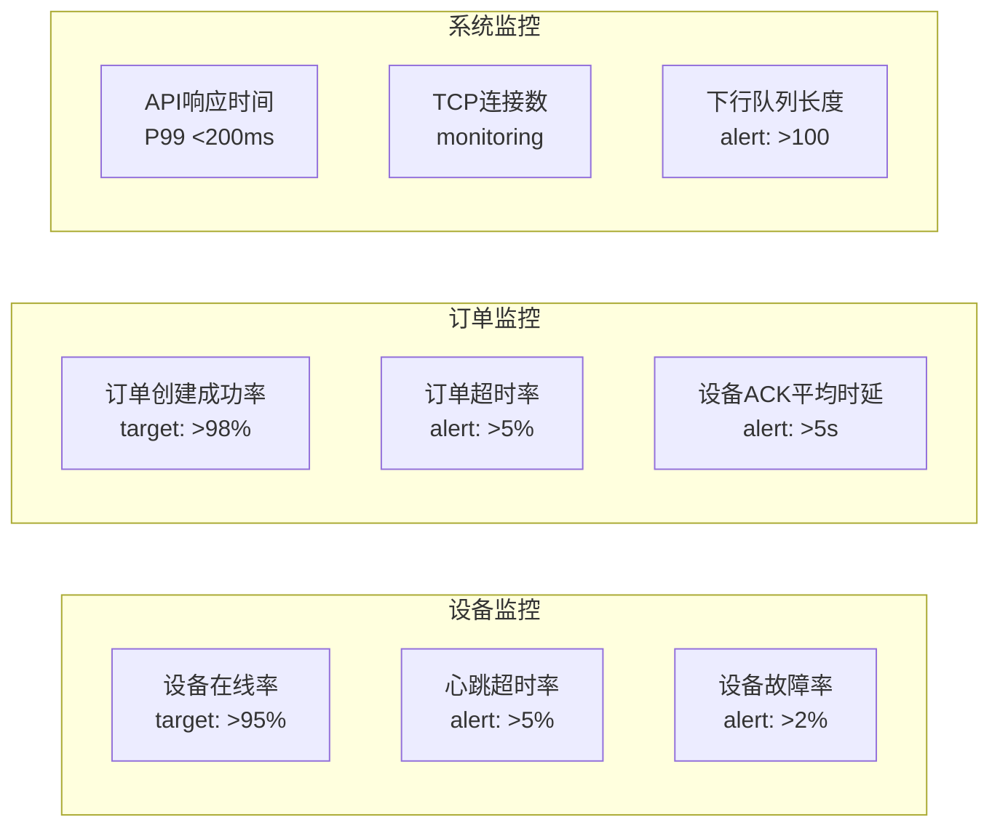

**Prometheus 指标定义**（`internal/metrics/metrics.go`）：

**设备指标**：

- `device_online_total`：在线设备数量（按协议分类：bkv, ap3000）
- `device_heartbeat_latency_seconds`：设备心跳延迟直方图

**订单指标**：

- `order_created_total`：订单创建总数（按状态分类：success, device_offline, port_occupied）
- `order_timeout_total`：超时订单总数
- `device_ack_latency_seconds`：设备 ACK 响应延迟

**系统指标**：

- `outbound_queue_length`：下行队列当前长度

### 7.2 告警规则

**Prometheus AlertManager 配置**（`configs/prometheus_alerts.yml`）：

**🔴 P0 告警 - Critical**：

- `DeviceMassOffline`：设备大面积离线
  - 条件：在线设备数 / 总设备数 < 80%
  - 持续：1 分钟
  - 描述：在线设备数低于 80%

**🟡 P1 告警 - Warning**：

- `HighOrderTimeoutRate`：订单超时率过高
  - 条件：订单超时率 > 10%
  - 持续：2 分钟
- `HighDeviceACKLatency`：设备 ACK 延迟过高
  - 条件：P95 延迟 > 5 秒
  - 持续：3 分钟

**🟢 P2 告警 - Info**：

- `OutboundQueueBacklog`：下行队列堆积
  - 条件：队列长度 > 100
  - 持续：5 分钟

### 7.3 后台监控任务

**Order Monitor**（`internal/app/order_monitor.go`）：

**运行周期**：每 30 秒执行一次

**任务列表**：

1. **清理超时 pending 订单**

   - 查找创建时间超过 10 秒但仍为 pending 状态的订单
   - 使用原子更新将状态变为 timeout
   - 记录超时订单数量

2. **检测充电中断订单**

   - 查找状态为 charging 但设备已离线（last_seen > 60 秒）的订单
   - 标记订单为 interrupted 状态
   - 推送设备离线事件到第三方
   - 等待 60 秒观察是否恢复
   - 未恢复则标记为 failed

3. **清理长期 pending 订单**
   - 查找创建时间超过 5 分钟的 pending 订单
   - 批量清理并记录日志

**关键 SQL(v2.2 版本修正)**：

- 超时订单(防止并发冲突):

  ```sql
  UPDATE orders SET status=4
  WHERE status=0
    AND created_at < NOW() - INTERVAL '10 seconds'
    AND updated_at < NOW() - INTERVAL '10 seconds'  -- 新增:避免与业务更新冲突
  ```

- 中断订单：

  ```sql
  SELECT * FROM orders o
  JOIN devices d ON o.device_id = d.id
  WHERE o.status=2
    AND d.last_seen_at < NOW() - INTERVAL '60 seconds'
  ```

- 超时 cancelling/stopping 订单(新增):

  ```sql
  -- cancelling超时变为cancelled
  UPDATE orders SET status=5
  WHERE status=8 AND updated_at < NOW() - INTERVAL '30 seconds';

  -- stopping超时变为stopped
  UPDATE orders SET status=7
  WHERE status=9 AND updated_at < NOW() - INTERVAL '30 seconds';
  ```

- interrupted 超时订单(新增):
  ```sql
  UPDATE orders SET status=6  -- failed
  WHERE status=10 AND updated_at < NOW() - INTERVAL '60 seconds'
  ```

---

## 附录

### A. 术语表

| 术语               | 说明                         | 数据库字段             |
| ------------------ | ---------------------------- | ---------------------- |
| **pending**        | 订单已创建，等待设备 ACK     | `status=0`             |
| **confirmed**      | 设备已确认，准备充电         | `status=1`             |
| **charging**       | 正在充电                     | `status=2`             |
| **completed**      | 充电完成                     | `status=3`             |
| **timeout**        | 设备 10 秒内无 ACK           | `status=4`             |
| **cancelled**      | 已取消                       | `status=5`             |
| **failed**         | 充电失败                     | `status=6`             |
| **stopped**        | 已停止                       | `status=7`             |
| **cancelling**     | 取消中（中间态）             | `status=8`             |
| **stopping**       | 停止中（中间态）             | `status=9`             |
| **interrupted**    | 充电中断（临时态）           | `status=10`            |
| **ACK**            | 设备确认响应                 | BKV 协议字段           |
| **last_seen_at**   | 设备最后心跳时间             | `devices.last_seen_at` |
| **online**         | 设备在线标志                 | `devices.online`       |
| **outbound_queue** | 下行指令队列                 | `outbound_queue表`     |
| **Outbox 模式**    | 事务性事件发布模式           | `events表`             |
| **CAS**            | Compare-And-Set 原子更新操作 | 乐观锁实现             |

### B. BKV 协议关键命令

| 命令号 | 命令名   | 方向        | 说明         | 文档位置 |
| ------ | -------- | ----------- | ------------ | -------- |
| 0x1007 | 心跳     | 设备 → 平台 | 每 30 秒发送 | 2.1 节   |
| 0x1004 | 网络节点 | 设备 → 平台 | 设备上线注册 | 2.2 节   |
| 0x100F | 端口状态 | 设备 → 平台 | 端口状态上报 | -        |
| 0x1010 | 刷卡充电 | 设备 → 平台 | 刷卡启动充电 | 2.2.9 节 |
| 0x1011 | 控制指令 | 平台 → 设备 | 下发充电指令 | 2.2.8 节 |

参考文档：`docs/协议/设备对接指引-组网设备2024(1).txt`

### C. 代码位置索引

| 功能模块        | 文件路径                                                    |
| --------------- | ----------------------------------------------------------- |
| HTTP API        | `internal/api/thirdparty_handler.go`                        |
| 设备在线检查    | `internal/storage/pg/device_repo.go::IsOnline()`            |
| 端口占用检查    | `internal/storage/pg/order_repo.go::GetActiveOrderByPort()` |
| 订单创建        | `internal/storage/pg/order_repo.go::CreateOrder()`          |
| 下行队列        | `internal/outbound/queue.go`                                |
| BKV 协议解析    | `internal/protocol/bkv/adapter.go`                          |
| BKV 指令处理    | `internal/protocol/bkv/handlers.go`                         |
| 订单监控        | `internal/service/order_monitor.go`                         |
| 事件推送        | `internal/thirdparty/pusher.go`                             |
| Prometheus 指标 | `internal/metrics/metrics.go`                               |

### D. 参考文档

- **BKV 协议文档**: `docs/协议/设备对接指引-组网设备2024(1).txt`
- **项目架构设计**: `docs/架构/项目架构设计.md`
- **第三方 API 文档**: `docs/api/第三方API文档.md`
- **事件推送规范**: `docs/api/事件推送规范.md`

---

## 📢 重要提醒

> **本文档定义的流程是技术规范，所有代码实现必须严格遵守！**
>
> **🔴 核心原则：设备离线时必须拒绝创建订单**
>
> 这是保护第三方业务的最后一道防线——避免用户已扣款但无法充电的情况。

---

_文档结束_
