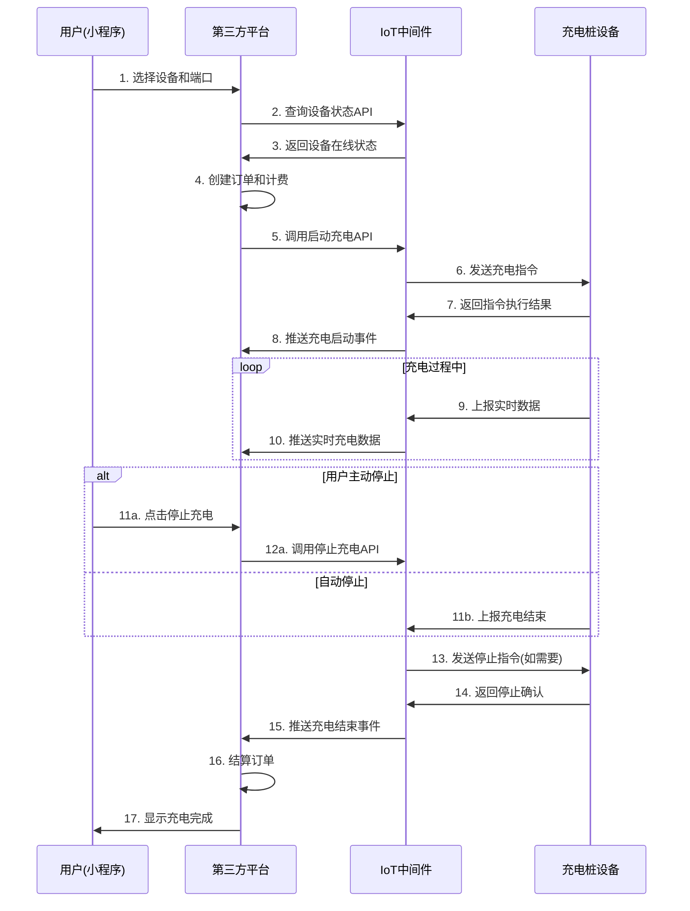

# 当前系统业务流程分析与功能缺陷识别

**分析目标**: 基于用户澄清的项目定位，深度分析当前IoT中间件的业务流程，识别关键缺陷和必要改进点

## 🔄 标准业务流程

### 用户充电完整流程


## 🔍 当前实现状态分析

### ✅ 已实现功能
1. **设备通信层**
   - TCP连接管理和心跳保持
   - 多协议支持（BKV/GN/AP3000）
   - 设备注册和状态维护
   - 出站指令队列和重试机制

2. **基础数据管理**
   - 设备信息存储
   - 端口状态管理
   - 命令日志记录
   - 订单基础数据

3. **第三方集成框架**
   - HTTP推送基础能力
   - 签名验证机制
   - 基础查询API

### ❌ 关键缺陷分析

#### 1. 第三方API严重不足
**问题描述**: 当前API过于简单，无法支撑完整业务流程

**具体缺陷**:
- ❌ 缺少充电控制API（启动/停止充电）
- ❌ 缺少设备管理API（参数设置、远程重启）
- ❌ 缺少批量操作API（批量查询/控制）
- ❌ 缺少实时数据查询API
- ❌ 缺少统计分析API

**业务影响**:
- 第三方平台无法完整控制设备
- 无法获取充电过程中的实时数据
- 无法进行批量设备管理
- 运营数据支撑不足

#### 2. 事件推送机制不完整
**问题描述**: 缺少关键业务事件的推送

**具体缺陷**:
- ❌ 缺少充电启动事件推送
- ❌ 缺少充电过程实时数据推送
- ❌ 缺少充电结束事件推送
- ❌ 缺少设备异常事件推送
- ❌ 缺少设备上下线事件推送

**业务影响**:
- 第三方平台无法实时获知设备状态变化
- 无法及时响应充电异常
- 用户体验差（无法实时显示充电进度）

#### 3. 数据统计能力缺失
**问题描述**: 缺少运营必需的统计分析功能

**具体缺陷**:
- ❌ 设备在线率统计
- ❌ 端口使用率统计  
- ❌ 充电成功率统计
- ❌ 设备故障率统计
- ❌ 业务趋势分析

**业务影响**:
- 无法监控系统整体运行状况
- 缺少运营决策数据支撑
- 无法及时发现系统问题

#### 4. 告警通知系统缺失
**问题描述**: 缺少主动的告警和通知机制

**具体缺陷**:
- ❌ 设备离线告警
- ❌ 充电异常告警
- ❌ 系统性能告警
- ❌ 业务指标告警

**业务影响**:
- 无法及时发现和处理设备故障
- 系统问题响应不及时
- 运维效率低下

## 📊 关键业务指标分析

### 必须监控的设备指标
```yaml
设备状态指标:
  - 设备在线率: online_devices / total_devices
  - 设备响应率: successful_commands / total_commands  
  - 平均响应时间: avg(command_response_time)
  - 设备故障率: fault_devices / total_devices

端口使用指标:
  - 端口利用率: charging_ports / total_ports
  - 平均充电时长: avg(charging_duration)
  - 充电成功率: successful_sessions / total_sessions
  - 端口故障率: fault_ports / total_ports

业务流程指标:
  - API成功率: successful_api_calls / total_api_calls
  - API响应时间: p95(api_response_time)
  - 事件推送成功率: successful_webhooks / total_webhooks
  - 数据完整性: complete_sessions / total_sessions
```

### 必须推送的关键事件
```yaml
设备事件:
  - device.online: 设备上线事件
  - device.offline: 设备离线事件
  - device.heartbeat: 心跳事件（可选，高频）
  - device.fault: 设备故障事件
  - device.recovered: 设备恢复事件

充电事件:
  - charging.started: 充电开始事件
  - charging.progress: 充电进度事件
  - charging.stopped: 充电停止事件
  - charging.completed: 充电完成事件
  - charging.failed: 充电失败事件

系统事件:
  - system.alarm: 系统告警事件
  - system.maintenance: 维护事件
  - api.error: API错误事件
```

## 🎯 核心功能优先级

### P0 (必须立即实现)
1. **充电控制API** - 核心业务功能
   - 启动充电API（支持多种模式）
   - 停止充电API
   - 充电状态查询API

2. **关键事件推送** - 业务流程必需
   - 充电启动/停止/完成事件
   - 设备上下线事件
   - 充电异常事件

3. **设备状态API** - 运营基础
   - 设备列表查询
   - 设备详情查询
   - 端口状态查询

### P1 (重要，尽快实现)
1. **设备管理API**
   - 设备参数配置
   - 远程重启功能
   - 固件升级管理

2. **基础统计API**
   - 设备在线统计
   - 端口使用统计
   - 基础业务指标

3. **批量操作API**
   - 批量设备控制
   - 批量状态查询

### P2 (有时间再实现)
1. **高级统计分析**
   - 趋势分析
   - 预测性分析
   - 自定义报表

2. **告警系统**
   - 告警规则配置
   - 多渠道通知
   - 告警升级机制

## 💡 具体改进建议

### 1. 立即补充的API接口

```go
// 必须补充的第三方API
POST /api/third/devices/{phyId}/charge/start      // 启动充电
POST /api/third/devices/{phyId}/charge/stop       // 停止充电  
GET  /api/third/devices/{phyId}/charge/status     // 充电状态
POST /api/third/devices/{phyId}/params            // 设备参数设置
GET  /api/third/devices/{phyId}/realtime          // 实时数据
GET  /api/third/stats/devices                     // 设备统计
GET  /api/third/stats/usage                       // 使用统计
POST /api/third/devices/batch/control             // 批量控制
POST /api/third/devices/batch/status              // 批量查询
```

### 2. 必须补充的事件推送

```json
// 充电启动事件
{
  "event": "charging.started",
  "device_phy_id": "DEV001",
  "timestamp": 1705123200,
  "data": {
    "port_no": 1,
    "order_no": "ORD20240113001",
    "mode": 1,
    "time_limit": 120,
    "estimated_power": 7000
  }
}

// 充电进度事件
{
  "event": "charging.progress", 
  "device_phy_id": "DEV001",
  "timestamp": 1705123260,
  "data": {
    "port_no": 1,
    "order_no": "ORD20240113001",
    "duration": 60,
    "energy_consumed": 1.2,
    "current_power": 7200,
    "voltage": 220.5,
    "current": 32.7
  }
}

// 设备离线事件
{
  "event": "device.offline",
  "device_phy_id": "DEV001", 
  "timestamp": 1705123300,
  "data": {
    "last_seen": "2024-01-13T10:20:00Z",
    "offline_duration": 300,
    "reason": "heartbeat_timeout"
  }
}
```

### 3. 必须补充的统计功能

```go
// 实时统计数据结构
type RealtimeStats struct {
    DeviceStats struct {
        TotalDevices   int64   `json:"total_devices"`
        OnlineDevices  int64   `json:"online_devices"`
        OfflineDevices int64   `json:"offline_devices"`
        OnlineRate     float64 `json:"online_rate"`
    } `json:"device_stats"`
    
    PortStats struct {
        TotalPorts    int64   `json:"total_ports"`
        IdlePorts     int64   `json:"idle_ports"`
        ChargingPorts int64   `json:"charging_ports"`
        FaultPorts    int64   `json:"fault_ports"`
        UtilizationRate float64 `json:"utilization_rate"`
    } `json:"port_stats"`
    
    BusinessStats struct {
        TodaySessions int64   `json:"today_sessions"`
        TodayEnergy   float64 `json:"today_energy"`
        AvgDuration   int64   `json:"avg_duration"`
        SuccessRate   float64 `json:"success_rate"`
    } `json:"business_stats"`
}
```

## 🚨 风险提示

### 技术风险
1. **API并发性能**: 需要考虑大量第三方平台同时调用的并发场景
2. **数据一致性**: 设备状态变更和API响应的一致性保证
3. **推送可靠性**: 网络异常时的事件推送重试和去重机制

### 业务风险  
1. **充电安全**: 充电控制API的安全性和异常处理
2. **数据准确性**: 统计数据的准确性和实时性要求
3. **系统稳定性**: 新增功能对现有稳定系统的影响

### 运维风险
1. **监控覆盖**: 新增功能的监控和告警覆盖
2. **性能影响**: 统计计算对系统性能的影响
3. **容量规划**: 随着功能增加的存储和计算资源需求

---

**结论**: 当前系统作为IoT中间件，协议层和基础设施已经很完善，但在第三方API、事件推送、数据统计和告警通知方面存在显著缺陷，需要重点补强这些功能才能真正支撑完整的充电桩业务流程。