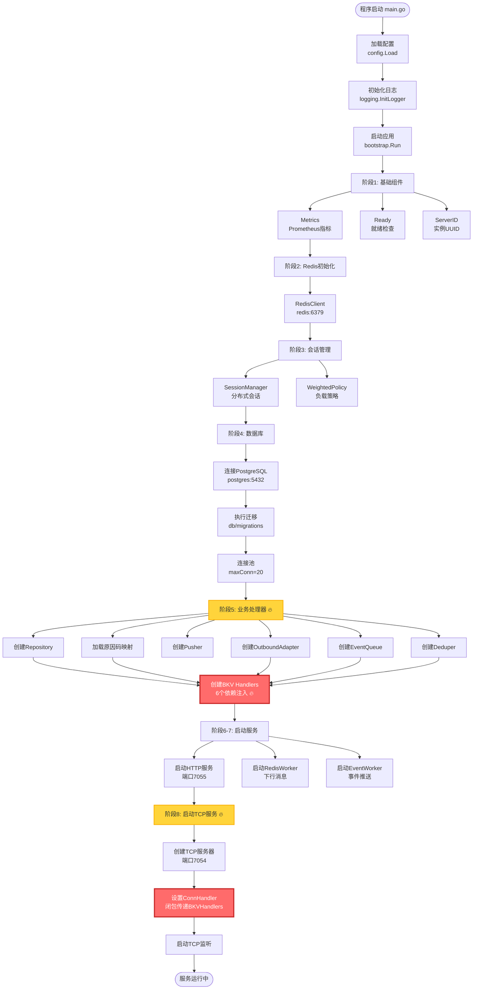
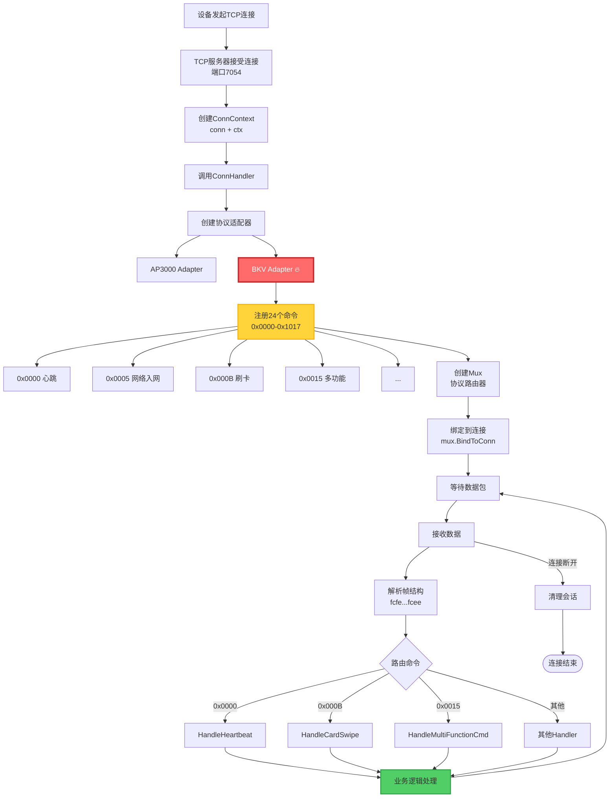
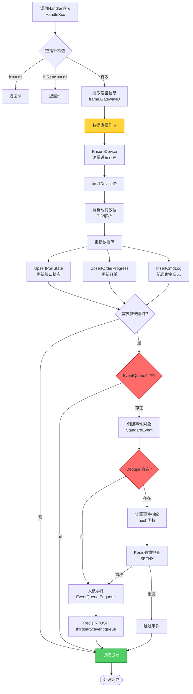
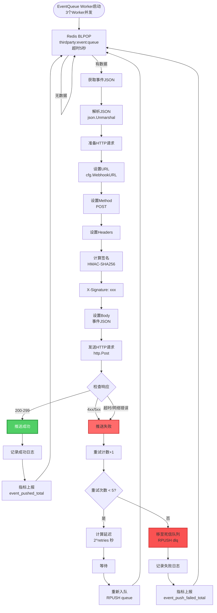
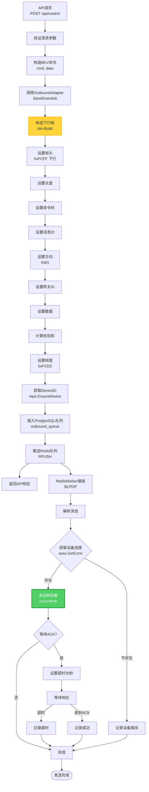
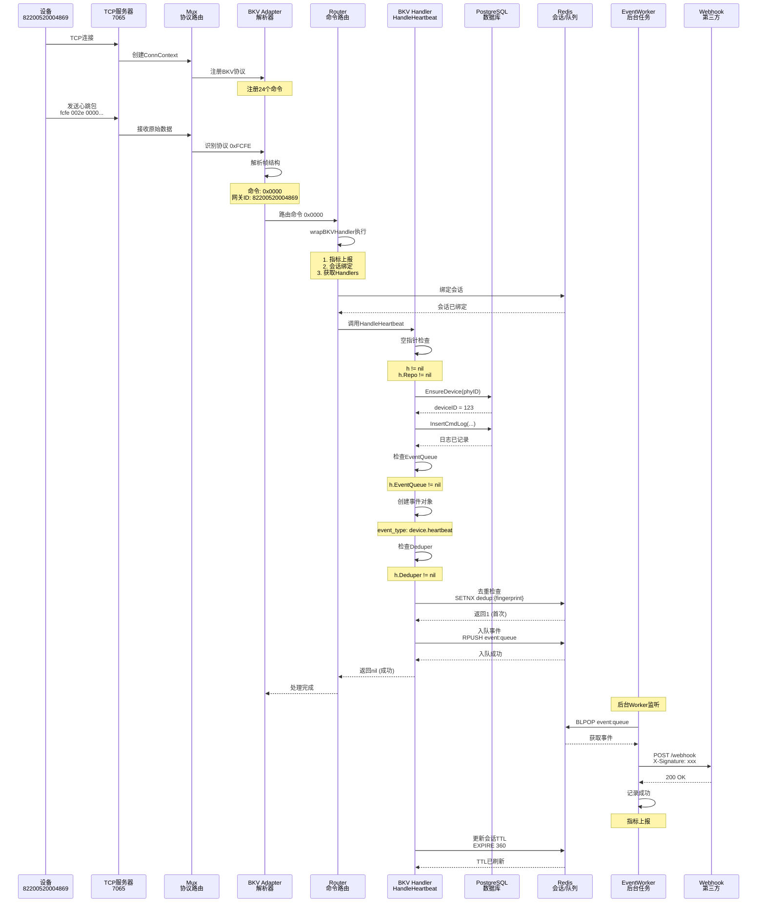
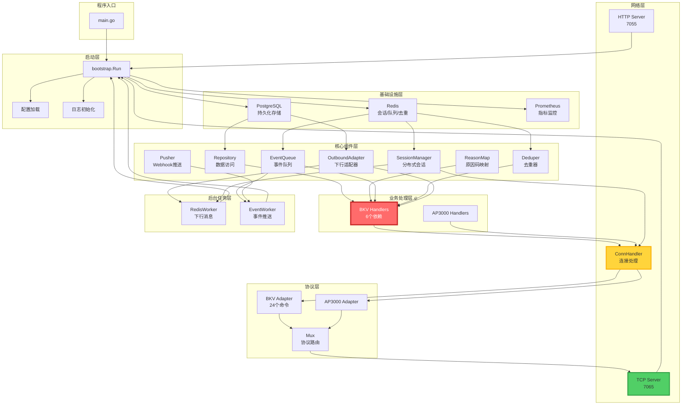

# IOT服务器数据流可视化图表 📊

**文档版本:** v1.0  
**创建时间:** 2025-10-20  
**适用工具:** GitHub, GitLab, Typora, VS Code (Mermaid插件)

---

## 1️⃣ 程序启动完整流程



---

## 2️⃣ TCP连接处理流程



---

## 3️⃣ BKV协议数据包处理流程

```mermaid
flowchart TD
    RawData[原始TCP数据<br/>[]byte] --> MuxRead[Mux.Read]
    MuxRead --> ReadHeader[读取帧头<br/>0xFCFE/0xFCFF]
    
    ReadHeader --> IdentifyProto{识别协议}
    IdentifyProto -->|0xFCFE/0xFCFF| BKVProto[BKV协议 🔥]
    IdentifyProto -->|其他| AP3000Proto[AP3000协议]
    
    BKVProto --> BKVDecode[BKV Parser解析]
    BKVDecode --> ParseHeader[解析帧头<br/>2字节]
    ParseHeader --> ParseLen[解析长度<br/>2字节]
    ParseLen --> ParseCmd[解析命令<br/>2字节 🔥]
    ParseCmd --> ParseMsgID[解析消息ID<br/>4字节]
    ParseMsgID --> ParseDir[解析方向<br/>1字节]
    ParseDir --> ParseGwID[解析网关ID<br/>7字节]
    ParseGwID --> ParseData[解析数据<br/>可变长度]
    ParseData --> ParseChecksum[解析校验和<br/>1字节]
    ParseChecksum --> ParseTail[解析帧尾<br/>1字节]
    
    ParseTail --> Validate{验证}
    Validate -->|失败| ParseError[解析错误]
    Validate -->|成功| CreateFrame[创建Frame对象]
    
    CreateFrame --> RouteByCmd[根据命令码路由]
    RouteByCmd --> FindHandler{查找Handler}
    FindHandler -->|未注册| NoHandler[未注册错误]
    FindHandler -->|已注册| WrapHandler[wrapBKVHandler]
    
    WrapHandler --> Metrics[指标上报<br/>BKVRouteTotal]
    Metrics --> BindSession[会话绑定<br/>bindIfNeeded]
    BindSession --> GetHandlers[获取Handlers<br/>getBKVHandlers 🔥]
    
    GetHandlers --> NilCheck{空指针检查}
    NilCheck -->|nil| ReturnNil[返回nil]
    NilCheck -->|有效| CallHandler[调用Handler方法]
    
    CallHandler --> HandlerLogic[Handler业务逻辑]
    HandlerLogic --> Success[处理成功]
    
    style ParseCmd fill:#ff6b6b,stroke:#c92a2a,stroke-width:3px,color:#fff
    style GetHandlers fill:#ff6b6b,stroke:#c92a2a,stroke-width:3px,color:#fff
    style HandlerLogic fill:#51cf66,stroke:#2f9e44,stroke-width:2px
```

---

## 4️⃣ BKV Handler业务逻辑流程



---

## 5️⃣ 事件推送后台处理流程



---

## 6️⃣ 下行消息发送流程



---

## 7️⃣ 会话管理流程

```mermaid
flowchart TD
    TCPAccept[TCP连接建立] --> FirstPacket[接收第一个数据包<br/>通常是心跳]
    FirstPacket --> ExtractPhyID[提取网关ID<br/>frame.GatewayID]
    
    ExtractPhyID --> CheckBound{已绑定?}
    CheckBound -->|是且相同| SkipBind[跳过绑定]
    CheckBound -->|否或不同| BindSession[绑定会话<br/>sess.Bind]
    
    BindSession --> GenConnID[生成ConnID<br/>uuid.New]
    GenConnID --> SaveLocal[保存本地连接<br/>localConn map]
    SaveLocal --> SaveRedis[保存到Redis]
    
    SaveRedis --> SetDevice[SET session:device:{phyID}<br/>conn_id, server_id, last_seen]
    SetDevice --> SetConn[SET session:conn:{connID}<br/>phyID]
    SetConn --> SetServer[SADD session:server:{serverID}:conns<br/>connID]
    SetServer --> SetTTL[EXPIRE 360秒]
    
    SetTTL --> UpdateBound[更新boundPhy]
    UpdateBound --> SkipBind
    
    SkipBind --> ProcessData[处理数据包]
    ProcessData --> Heartbeat{是心跳?}
    
    Heartbeat -->|是| UpdateSession[更新会话<br/>sess.OnHeartbeat]
    UpdateSession --> RefreshRedis[刷新Redis TTL<br/>EXPIRE 360]
    RefreshRedis --> WaitNext[等待下一个包]
    
    Heartbeat -->|否| WaitNext
    WaitNext --> NextPacket{收到数据?}
    
    NextPacket -->|是| ProcessData
    NextPacket -->|连接断开| Unbind[解绑会话<br/>sess.UnbindByPhy]
    
    Unbind --> DelDevice[DEL session:device:{phyID}]
    DelDevice --> DelConn[DEL session:conn:{connID}]
    DelConn --> DelServer[SREM session:server:{serverID}:conns]
    DelServer --> DelLocal[删除本地连接<br/>delete localConn]
    
    DelLocal --> LogClosed[记录TCP关闭<br/>sess.OnTCPClosed]
    LogClosed --> UpdateMetrics[更新指标<br/>SessionOfflineTotal]
    UpdateMetrics --> End([连接结束])
    
    style BindSession fill:#ffd43b,stroke:#fab005,stroke-width:2px
    style SaveRedis fill:#ff6b6b,stroke:#c92a2a,stroke-width:2px
    style Unbind fill:#fa5252,stroke:#c92a2a,stroke-width:2px
```

---

## 8️⃣ 完整心跳处理数据流



---

## 9️⃣ 依赖关系图



---

## 🔟 数据存储关系图

```mermaid
erDiagram
    DEVICES ||--o{ PORTS : has
    DEVICES ||--o{ ORDERS : has
    DEVICES ||--o{ CMD_LOG : has
    DEVICES ||--o{ OUTBOUND_QUEUE : has
    DEVICES ||--o{ GATEWAY_SOCKETS : has
    DEVICES ||--o{ OTA_TASKS : has
    DEVICES ||--o{ DEVICE_PARAMS : has
    DEVICES ||--o{ DEVICE_CARDS : has
    DEVICES ||--o{ CARD_TRANSACTIONS : has
    
    DEVICES {
        bigserial id PK
        varchar phy_id UK "网关物理ID"
        timestamp created_at
        timestamp updated_at
    }
    
    PORTS {
        bigserial id PK
        bigint device_id FK
        int port_no
        int status "端口状态"
        int power_w "功率"
        timestamp updated_at
    }
    
    ORDERS {
        bigserial id PK
        bigint device_id FK
        int port_no
        varchar order_no UK "订单号"
        bigint kwh_0p01 "电量(0.01度)"
        int status "订单状态"
        timestamp start_time
        timestamp created_at
        timestamp updated_at
    }
    
    CMD_LOG {
        bigserial id PK
        bigint device_id FK
        bigint msg_id "消息ID"
        int cmd "命令码"
        int direction "方向"
        bytea payload "载荷"
        boolean success "是否成功"
        timestamp created_at
    }
    
    OUTBOUND_QUEUE {
        bigserial id PK
        bigint device_id FK
        varchar phy_id "网关ID"
        int cmd "命令码"
        bytea payload "载荷"
        int priority "优先级"
        bigint msg_id "消息ID"
        timestamp created_at
    }
    
    GATEWAY_SOCKETS {
        bigserial id PK
        bigint device_id FK
        int socket_no "插座号"
        boolean online "在线状态"
        varchar version "版本号"
        timestamp created_at
        timestamp updated_at
    }
    
    OTA_TASKS {
        bigserial id PK
        bigint device_id FK
        varchar file_url "升级文件URL"
        varchar version "目标版本"
        int status "任务状态"
        timestamp created_at
        timestamp updated_at
    }
    
    DEVICE_PARAMS {
        bigserial id PK
        bigint device_id FK
        varchar param_name "参数名"
        varchar param_value "参数值"
        timestamp created_at
        timestamp updated_at
    }
    
    DEVICE_CARDS {
        bigserial id PK
        bigint device_id FK
        varchar card_no "卡号"
        varchar card_type "卡类型"
        timestamp created_at
    }
    
    CARD_TRANSACTIONS {
        bigserial id PK
        bigint device_id FK
        int port_no
        varchar card_no "卡号"
        varchar order_no "订单号"
        int action "操作类型"
        timestamp created_at
    }
```



---

## 📊 Redis数据结构

```mermaid
graph TB
    subgraph "会话管理"
        SD[session:device:{phyID}<br/>Hash: conn_id, server_id, last_seen]
        SC[session:conn:{connID}<br/>String: phyID]
        SS[session:server:{serverID}:conns<br/>Set: connID集合]
    end
    
    subgraph "消息队列"
        OQ[outbound:queue:{serverID}<br/>List: 下行消息队列]
        EQ[thirdparty:event:queue<br/>List: 事件队列]
        DLQ[thirdparty:event:dlq<br/>List: 死信队列]
    end
    
    subgraph "去重"
        DD[thirdparty:dedup:{fingerprint}<br/>String: 1, TTL=3600]
    end
    
    subgraph "临时数据"
        ACK[ack:{msgID}<br/>String: response, TTL=30]
    end
    
    style SD fill:#4dabf7,stroke:#1971c2,stroke-width:2px
    style EQ fill:#ffd43b,stroke:#fab005,stroke-width:2px
    style DD fill:#ff6b6b,stroke:#c92a2a,stroke-width:2px
```

---

## ✅ 文档使用说明

### 查看方式

1. **GitHub/GitLab**: 直接在仓库中查看，自动渲染Mermaid图表
2. **Typora**: 支持Mermaid的Markdown编辑器
3. **VS Code**: 安装 "Markdown Preview Mermaid Support" 插件
4. **在线工具**: 复制到 [Mermaid Live Editor](https://mermaid.live/)

### 图表说明

- 🔥 **红色高亮**: 核心关键节点（BKV Handlers、闭包传递等）
- 🟡 **黄色高亮**: 重要阶段（启动阶段、命令注册等）
- 🟢 **绿色高亮**: 成功完成状态

### 图表索引

| 图表 | 描述 | 关键点 |
|------|------|--------|
| **图1** | 程序启动完整流程 | 9个启动阶段，BKV Handlers初始化 |
| **图2** | TCP连接处理流程 | 24个命令注册，协议路由 |
| **图3** | BKV数据包处理 | 帧解析，命令路由，Handler调用 |
| **图4** | Handler业务逻辑 | 数据库操作，事件推送，去重 |
| **图5** | 事件推送流程 | 3个Worker，重试机制，死信队列 |
| **图6** | 下行消息发送 | Redis队列，连接获取，ACK等待 |
| **图7** | 会话管理流程 | Redis分布式会话，TTL刷新 |
| **图8** | 心跳时序图 | 完整数据流，所有组件交互 |
| **图9** | 依赖关系图 | 组件依赖，数据流向 |
| **图10** | 数据存储ER图 | 9张表，关系映射 |

---

**所有可视化图表已完成！可直接在支持Mermaid的工具中查看！** 🎉
