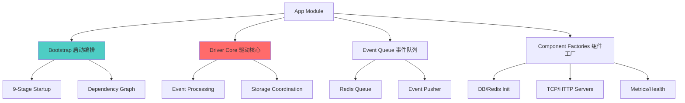
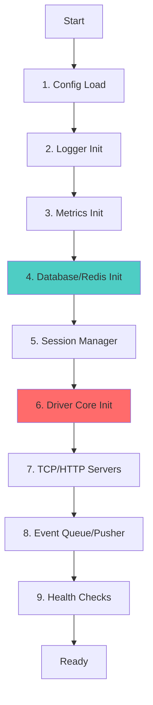
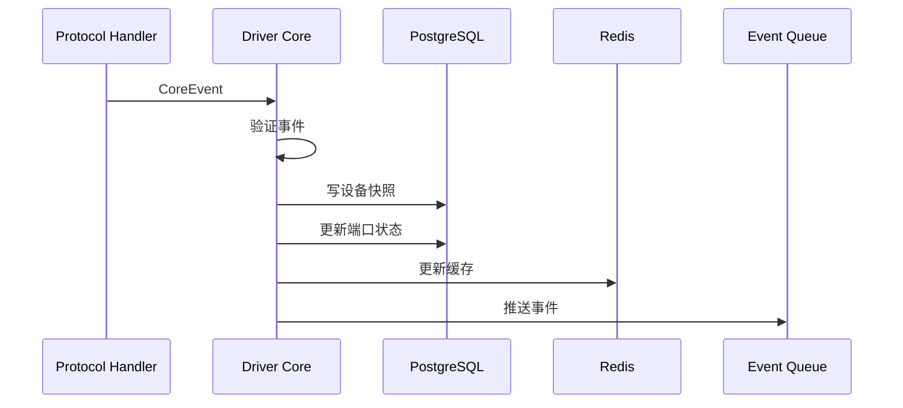

# App Module - 应用引导与核心逻辑

> **导航**: [← 返回根目录](../../CLAUDE.md)
> **路径**: `internal/app/`
> **最后更新**: 2025-11-28

---

## 📋 模块职责

App 模块是整个应用的引导层和依赖注入容器，负责：

- **应用启动**: 9阶段启动流程编排
- **依赖注入**: 组件初始化与依赖管理
- **核心引擎**: Driver Core 事件处理引擎
- **生命周期**: 组件启动、停止、优雅关闭

---

## 🏗️ 模块结构



---

## 📂 文件结构

```
app/
├── bootstrap/
│   └── app.go              # [核心] 启动编排器
├── driver_core.go          # [核心] 事件处理引擎
├── driver_core_test.go     # 核心测试
├── event_queue.go          # 事件队列管理
├── event_pusher.go         # Webhook 推送
├── outbound_adapter.go     # 出站适配器
├── port_status_syncer.go   # 端口状态同步器
├── dead_letter_cleaner.go  # 死信清理器
├── db.go                   # PostgreSQL 初始化
├── redis.go                # Redis 初始化
├── session.go              # Session Manager 工厂
├── tcp.go                  # TCP Server 工厂
├── http.go                 # HTTP Server 工厂
├── metrics.go              # Metrics 初始化
├── health.go               # Health Check 工厂
├── ready.go                # Readiness Check
├── server_id.go            # Server ID 生成
└── thirdparty.go           # 第三方集成初始化
```

---

## 🚀 9 阶段启动流程

### bootstrap/app.go



### 启动阶段详解

| 阶段 | 组件 | 职责 | 失败影响 |
|------|------|------|---------|
| 1 | Config | 加载 YAML 配置 | 致命，无法启动 |
| 2 | Logger | 初始化 Zap 日志 | 致命，无法记录 |
| 3 | Metrics | Prometheus 注册 | 非致命，降级运行 |
| 4 | DB/Redis | PostgreSQL + Redis 连接 | 致命，核心依赖 |
| 5 | Session | Redis Session Manager | 致命，设备会话 |
| 6 | Driver Core | 事件处理引擎 | 致命，核心逻辑 |
| 7 | Servers | TCP + HTTP 服务器 | 致命，无法接受连接 |
| 8 | Event Queue | 事件队列 + Pusher | 重要，影响推送 |
| 9 | Health | 健康检查聚合 | 非致命，影响监控 |

---

## 🔑 核心组件

### 1. Driver Core (driver_core.go)

**职责**: 事件处理引擎，协调协议层→存储层

```go
type DriverCore struct {
    repo   storage.CoreRepo
    redis  *redis.Client
    logger *zap.Logger
}

func (dc *DriverCore) HandleCoreEvent(ctx context.Context, ev *coremodel.CoreEvent) error {
    // 1. 验证事件
    // 2. 写入 PostgreSQL (设备/端口快照)
    // 3. 更新 Redis 缓存
    // 4. 推送到事件队列
}
```

**关键方法**:
- `HandleCoreEvent()` - 接收协议驱动上报的规范化事件
- `HandleConnectionEvent()` - 处理设备连接/断开事件
- `HandleStatusEvent()` - 处理状态上报事件
- `HandleCommandResponse()` - 处理命令响应

**事件处理流程**:


### 2. Event Queue (event_queue.go)

**职责**: Redis 事件队列管理

```go
type EventQueue struct {
    redis  *redis.Client
    logger *zap.Logger
}

func (eq *EventQueue) Push(ctx context.Context, event *Event) error {
    // 推送事件到 Redis List
}

func (eq *EventQueue) Pop(ctx context.Context) (*Event, error) {
    // 从 Redis List 弹出事件（阻塞）
}
```

**队列模式**:
- 使用 Redis List (`LPUSH` + `BRPOP`)
- 支持多消费者（Event Pusher workers）
- 失败重试 + 死信队列

### 3. Event Pusher (event_pusher.go)

**职责**: Webhook 事件推送

```go
type EventPusher struct {
    queue      *EventQueue
    httpClient *http.Client
    webhookURL string
}

func (ep *EventPusher) Start(ctx context.Context) {
    // 启动 worker goroutines
    for i := 0; i < workerCount; i++ {
        go ep.worker(ctx)
    }
}
```

**推送特性**:
- 多 worker 并发推送
- 失败重试（指数退避）
- 熔断保护
- 去重机制

### 4. Port Status Syncer (port_status_syncer.go)

**职责**: 定期同步端口状态到 PostgreSQL

```go
type PortStatusSyncer struct {
    redis  *redis.Client
    repo   storage.CoreRepo
    ticker *time.Ticker
}

func (pss *PortStatusSyncer) Start(ctx context.Context) {
    // 定期从 Redis 同步到 PostgreSQL
    for {
        select {
        case <-pss.ticker.C:
            pss.syncAll(ctx)
        case <-ctx.Done():
            return
        }
    }
}
```

---

## 🔧 依赖注入模式

### 组件工厂函数

每个组件都有对应的工厂函数，返回已初始化的实例：

```go
// db.go
func NewDB(cfg *config.DatabaseConfig) (*gorm.DB, error)

// redis.go
func NewRedis(cfg *config.RedisConfig) (*redis.Client, error)

// session.go
func NewSessionManager(redis *redis.Client) session.Manager

// tcp.go
func NewTCPServer(cfg *config.TCPConfig, handler Handler) *TCPServer
```

### Bootstrap 编排

```go
// bootstrap/app.go
func Run(cfg *config.Config, logger *zap.Logger) error {
    // 阶段 4: 初始化存储
    db := app.NewDB(cfg.Database)
    redis := app.NewRedis(cfg.Redis)

    // 阶段 5: Session Manager
    sessMgr := app.NewSessionManager(redis)

    // 阶段 6: Driver Core (依赖 db, redis)
    core := app.NewDriverCore(db, redis, logger)

    // 阶段 7: TCP Server (依赖 core, sessMgr)
    tcpServer := app.NewTCPServer(cfg.TCP, core, sessMgr)

    // ... 启动所有组件
}
```

---

## 🧪 测试

### Driver Core 测试 (driver_core_test.go)

```bash
# 运行核心测试
go test ./internal/app -run TestDriverCore -v

# 测试覆盖率
go test ./internal/app -coverprofile=coverage.out
```

### 测试策略

- **单元测试**: 测试 Driver Core 事件处理逻辑
- **集成测试**: 测试完整的启动流程
- **Mock**: 使用 gomock mock 存储层

### 示例测试

```go
func TestDriverCoreHandleEvent(t *testing.T) {
    // Setup
    ctrl := gomock.NewController(t)
    defer ctrl.Finish()

    mockRepo := storage.NewMockCoreRepo(ctrl)
    mockRepo.EXPECT().SaveDevice(gomock.Any(), gomock.Any()).Return(nil)

    core := &DriverCore{repo: mockRepo}

    // Execute
    event := &coremodel.CoreEvent{Type: "CONNECTION"}
    err := core.HandleCoreEvent(context.Background(), event)

    // Assert
    assert.NoError(t, err)
}
```

---

## 🔍 关键设计模式

### 1. 依赖注入

所有组件通过构造函数注入依赖，避免全局变量：

```go
// ❌ Bad: 全局变量
var globalDB *gorm.DB

// ✅ Good: 依赖注入
type DriverCore struct {
    repo storage.CoreRepo  // 接口依赖
}
```

### 2. 接口抽象

Driver Core 依赖接口而非具体实现：

```go
type CoreRepo interface {
    SaveDevice(ctx context.Context, device *Device) error
    UpdatePort(ctx context.Context, port *Port) error
}
```

### 3. Context 传递

所有 IO 操作接受 `context.Context`，支持超时和取消：

```go
func (dc *DriverCore) HandleCoreEvent(ctx context.Context, ev *CoreEvent) error {
    ctx, cancel := context.WithTimeout(ctx, 5*time.Second)
    defer cancel()

    return dc.repo.SaveDevice(ctx, device)
}
```

### 4. 优雅关闭

所有长期运行的组件支持优雅关闭：

```go
func (ep *EventPusher) Shutdown(ctx context.Context) error {
    ep.cancel()  // 通知所有 workers 停止
    return ep.wg.Wait()  // 等待所有任务完成
}
```

---

## 📊 监控与指标

### Metrics (metrics.go)

```go
type AppMetrics struct {
    EventsProcessed prometheus.Counter
    EventQueueSize  prometheus.Gauge
    DBQueryDuration prometheus.Histogram
}
```

**关键指标**:
- `app_events_processed_total` - 已处理事件总数
- `app_event_queue_size` - 队列待处理事件数
- `app_db_query_duration_seconds` - 数据库查询耗时
- `app_redis_operations_total` - Redis 操作次数

### Health Checks (health.go, ready.go)

```go
type HealthAggregator struct {
    checkers []HealthChecker
}

func (ha *HealthAggregator) CheckHealth(ctx context.Context) HealthStatus {
    // 聚合所有子检查
}
```

**健康检查项**:
- PostgreSQL 连接
- Redis 连接
- TCP 服务器状态
- HTTP 服务器状态

---

## 🚨 常见问题

### Q1: 启动失败 "database connection refused"

**原因**: PostgreSQL 未启动或配置错误

**解决**:
```bash
# 检查 PostgreSQL 状态
docker-compose ps postgres

# 查看配置
cat configs/local.yaml | grep database

# 测试连接
psql -h localhost -U iot -d iot_server
```

### Q2: Event Queue 堆积

**原因**: Webhook 推送失败或速度慢

**解决**:
```bash
# 查看队列长度
redis-cli LLEN event_queue

# 增加 worker 数量（配置文件）
event_queue:
  worker_count: 10

# 启用熔断
event_pusher:
  circuit_breaker_enabled: true
```

### Q3: Driver Core 事件丢失

**原因**: Redis/PostgreSQL 写入失败

**解决**:
```go
// 检查日志
grep "failed to handle event" logs/iot-server.log

// 启用事务（driver_core.go）
tx := dc.db.Begin()
defer tx.Rollback()
// ... 处理事件
tx.Commit()
```

---

## 🔗 相关文档

- [Bootstrap 启动流程](bootstrap/CLAUDE.md)
- [Protocol 协议模块](../protocol/CLAUDE.md)
- [Storage 存储模块](../storage/CLAUDE.md)
- [Session 会话模块](../session/CLAUDE.md)
- [Outbound 出站模块](../outbound/CLAUDE.md)

---

**最后更新**: 2025-11-28
**维护者**: App Team
