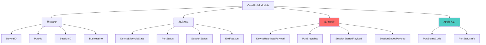
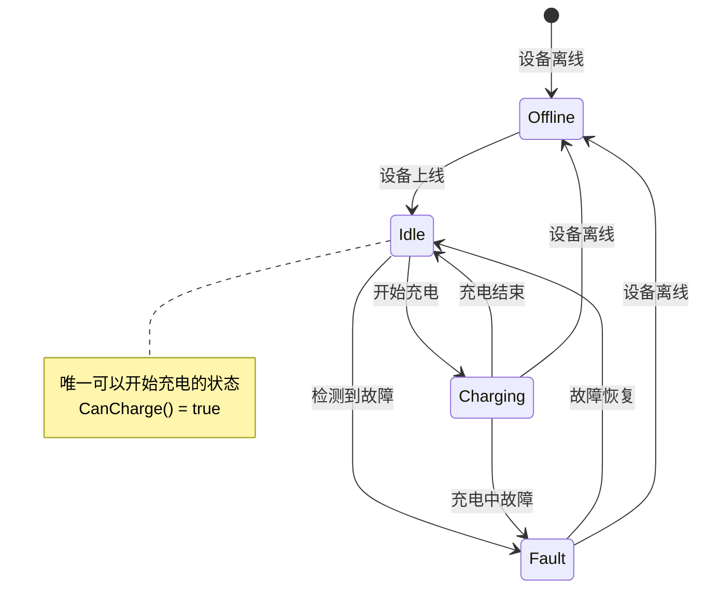
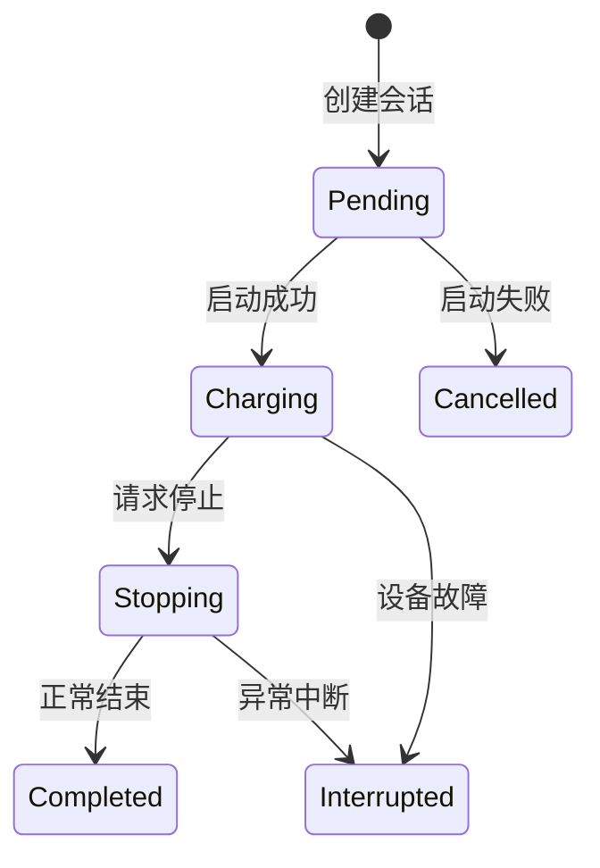

# CoreModel Module - 核心数据模型

> **导航**: [← 返回根目录](../../CLAUDE.md)
> **路径**: `internal/coremodel/`
> **最后更新**: 2025-11-28

---

## 📋 模块职责

CoreModel 模块定义了系统中的**规范化数据模型和业务枚举**，是所有层次共享的核心领域模型：

- **数据类型定义**: DeviceID, PortNo, SessionID 等类型别名
- **状态枚举**: 设备状态、端口状态、会话状态
- **事件载荷**: 心跳、状态快照、会话开始/结束
- **API 状态码**: 统一的端口状态码系统
- **业务规则**: 状态转换规则、充电判断逻辑

---

## 🏗️ 模块结构



---

## 📂 文件结构

```
coremodel/
├── model.go             # [核心] 基础类型、枚举、事件载荷
├── port_status.go       # [核心] API 状态码系统
└── port_status_test.go  # API 状态码测试
```

---

## 🔑 核心定义

### 1. 基础类型别名 (model.go)

```go
// DeviceID 统一设备标识类型
type DeviceID string

// PortNo 端口编号，0-based
type PortNo int32

// SessionID 技术会话ID
type SessionID string

// BusinessNo 上游业务订单号
type BusinessNo string
```

**设计目的**:
- 类型安全：避免混淆设备ID、端口号等
- 语义清晰：代码可读性更好
- 便于重构：统一修改类型定义

### 2. 设备生命周期状态

```go
type DeviceLifecycleState string

const (
    DeviceStateUnknown        DeviceLifecycleState = "unknown"         // 未知状态
    DeviceStateOnline         DeviceLifecycleState = "online"          // 在线
    DeviceStateOffline        DeviceLifecycleState = "offline"         // 离线
    DeviceStateMaintenance    DeviceLifecycleState = "maintenance"     // 维护中
    DeviceStateDecommissioned DeviceLifecycleState = "decommissioned"  // 已退役
)
```

### 3. 端口状态枚举（技术视角）

```go
type PortStatus string

const (
    PortStatusUnknown  PortStatus = "unknown"   // 未知
    PortStatusOffline  PortStatus = "offline"   // 离线
    PortStatusIdle     PortStatus = "idle"      // 空闲
    PortStatusCharging PortStatus = "charging"  // 充电中
    PortStatusFault    PortStatus = "fault"     // 故障
)
```

### 4. 会话状态枚举

```go
type SessionStatus string

const (
    SessionStatusPending     SessionStatus = "pending"      // 待启动
    SessionStatusCharging    SessionStatus = "charging"     // 充电中
    SessionStatusStopping    SessionStatus = "stopping"     // 停止中
    SessionStatusCompleted   SessionStatus = "completed"    // 已完成
    SessionStatusCancelled   SessionStatus = "cancelled"    // 已取消
    SessionStatusInterrupted SessionStatus = "interrupted"  // 已中断
)
```

---

## 📊 API 状态码系统 (port_status.go)

### PortStatusCode 定义

```go
type PortStatusCode int

const (
    StatusCodeOffline  PortStatusCode = 0  // 设备离线
    StatusCodeIdle     PortStatusCode = 1  // 空闲可用 - 唯一可充电状态
    StatusCodeCharging PortStatusCode = 2  // 充电中
    StatusCodeFault    PortStatusCode = 3  // 故障
)
```

### 核心业务规则

**充电判断逻辑**:
```go
// CanCharge 判断当前状态是否可以开始充电
// 核心业务逻辑：只有 StatusCodeIdle (1) 才能充电
func (c PortStatusCode) CanCharge() bool {
    return c == StatusCodeIdle
}
```

### PortStatusInfo 结构

```go
type PortStatusInfo struct {
    Code         int    `json:"code"`          // 状态码
    Name         string `json:"name"`          // 英文名称 (offline/idle/charging/fault)
    DisplayText  string `json:"display_text"`  // 显示文本（中文）
    Description  string `json:"description"`   // 详细描述
    CanCharge    bool   `json:"can_charge"`    // 是否可以开始充电
    DisplayColor string `json:"display_color"` // 建议显示颜色
}
```

### 状态码详情

| Code | Name | 显示文本 | 可充电 | 颜色 | 说明 |
|------|------|---------|--------|------|------|
| 0 | offline | 设备离线 | ❌ | gray | 设备离线，无法通信 |
| 1 | idle | 空闲可用 | ✅ | green | 设备在线，空闲可用，**唯一可以开始充电的状态** |
| 2 | charging | 使用中 | ❌ | yellow | 正在充电中，端口被占用 |
| 3 | fault | 故障 | ❌ | red | 设备故障，需要维护 |

### 使用示例

```go
// API 响应端口状态
port := getPort(deviceID, portNo)
statusInfo := PortStatusCode(port.Status).ToInfo()

response := gin.H{
    "port_no": portNo,
    "status":  statusInfo,
}
// 输出:
// {
//   "port_no": 1,
//   "status": {
//     "code": 1,
//     "name": "idle",
//     "display_text": "空闲可用",
//     "description": "设备在线，空闲可用,可以开始充电",
//     "can_charge": true,
//     "display_color": "green"
//   }
// }
```

---

## 🎯 事件载荷

### 1. 设备心跳载荷

```go
type DeviceHeartbeatPayload struct {
    DeviceID     DeviceID
    Status       DeviceLifecycleState
    LastSeenAt   time.Time
    TemperatureC *int32  // 可选：设备温度（摄氏度）
    RSSIDBm      *int32  // 可选：信号强度（dBm）
}
```

**使用场景**: 设备定期上报心跳，更新在线状态

### 2. 端口状态快照

```go
type PortSnapshot struct {
    DeviceID  DeviceID
    PortNo    PortNo
    SocketNo  *int32       // 可选：插座编号（GN协议）
    Status    PortStatus   // 技术状态
    RawStatus int32        // 协议侧原始状态值（例如BKV位图）
    PowerW    *int32       // 功率（瓦）
    CurrentmA *int32       // 电流（毫安）
    VoltageV  *int32       // 电压（伏特）
    TempC     *int32       // 温度（摄氏度）
    At        time.Time    // 快照时间
}
```

**使用场景**: 协议层上报端口状态变化

**RawStatus 说明**:
- 保存协议侧原始状态值
- 例如 BKV 协议的位图状态
- 供核心直接持久化或进一步映射

### 3. 会话开始载荷

```go
type SessionStartedPayload struct {
    DeviceID   DeviceID
    PortNo     PortNo
    BusinessNo BusinessNo   // 业务订单号
    SessionID  *SessionID   // 可选：技术会话ID
    StartedAt  time.Time
}
```

**使用场景**: 充电会话启动时上报

### 4. 会话结束载荷

```go
type SessionEndedPayload struct {
    DeviceID       DeviceID
    PortNo         PortNo
    BusinessNo     BusinessNo
    EnergyKWh01    int32        // 电量（0.1千瓦时）
    DurationSec    int32        // 时长（秒）
    EndReasonCode  EndReason    // 结束原因
    InstantPowerW  *int32       // 可选：瞬时功率
    AmountCent     *int64       // 可选：金额（分）
    OccurredAt     time.Time    // 发生时间
    RawReason      *int32       // 可选：协议原始结束原因
    NextPortStatus *int32       // 可选：结束后端口状态
    RawStatus      *int32       // 可选：原始状态
}
```

**使用场景**: 充电会话结束时上报

---

## 🔄 状态转换规则

### 端口状态转换



### 会话状态转换



---

## 🎨 设计模式

### 1. 类型别名模式

**优势**:
- 编译期类型检查
- 代码语义清晰
- 易于重构

**示例**:
```go
// ✅ 类型安全
func UpdatePort(deviceID DeviceID, portNo PortNo) error

// ❌ 易混淆
func UpdatePort(deviceID string, portNo int32) error
```

### 2. 信息丰富对象模式

**PortStatusInfo 设计**:
- 不仅提供代码，还提供显示文本
- 包含业务规则（CanCharge）
- 提供UI提示（DisplayColor）

### 3. 不可变数据模式

**所有事件载荷都是值对象**:
```go
// 事件载荷应该是不可变的
snapshot := &PortSnapshot{
    DeviceID: "dev123",
    PortNo:   1,
    Status:   PortStatusIdle,
    At:       time.Now(),
}
// 不应该修改 snapshot 的字段
```

---

## 🧪 测试

### 单元测试

```bash
# 运行 coremodel 测试
go test ./internal/coremodel -v

# 测试覆盖率
go test ./internal/coremodel -coverprofile=coverage.out
```

### 测试示例 (port_status_test.go)

```go
func TestPortStatusCode_CanCharge(t *testing.T) {
    tests := []struct {
        status   PortStatusCode
        expected bool
    }{
        {StatusCodeOffline, false},
        {StatusCodeIdle, true},      // 唯一可充电
        {StatusCodeCharging, false},
        {StatusCodeFault, false},
    }

    for _, tt := range tests {
        t.Run(tt.status.String(), func(t *testing.T) {
            assert.Equal(t, tt.expected, tt.status.CanCharge())
        })
    }
}

func TestPortStatusCode_ToInfo(t *testing.T) {
    info := StatusCodeIdle.ToInfo()

    assert.Equal(t, 1, info.Code)
    assert.Equal(t, "idle", info.Name)
    assert.Equal(t, "空闲可用", info.DisplayText)
    assert.True(t, info.CanCharge)
    assert.Equal(t, "green", info.DisplayColor)
}
```

---

## 📋 使用最佳实践

### 1. 类型转换

```go
// ✅ 显式转换
deviceID := DeviceID("dev123")
portNo := PortNo(1)

// ✅ API 响应
info := PortStatusCode(port.Status).ToInfo()

// ❌ 隐式使用字符串
func UpdatePort(deviceID string, portNo int) error
```

### 2. 状态判断

```go
// ✅ 使用 CanCharge 方法
if PortStatusCode(port.Status).CanCharge() {
    // 可以开始充电
}

// ❌ 硬编码状态值
if port.Status == 1 {
    // 不推荐
}
```

### 3. 事件构造

```go
// ✅ 完整构造事件载荷
snapshot := &PortSnapshot{
    DeviceID:  DeviceID(phyID),
    PortNo:    PortNo(portNo),
    Status:    PortStatusIdle,
    RawStatus: rawStatus,
    PowerW:    &powerW,
    At:        time.Now(),
}

// ❌ 缺少关键字段
snapshot := &PortSnapshot{
    DeviceID: DeviceID(phyID),
    PortNo:   PortNo(portNo),
}
```

---

## 🔍 常见问题

### Q1: 为什么使用类型别名而不是直接用 string/int？

**答案**: 类型安全和代码可读性
```go
// ✅ 编译器会检查类型
func UpdatePort(deviceID DeviceID, portNo PortNo)

// ❌ 容易传错参数
func UpdatePort(deviceID string, portNo int)
// 可能会误传：UpdatePort("1", "dev123")  // 编译通过但逻辑错误
```

### Q2: PortStatus 和 PortStatusCode 有什么区别？

**答案**:
- `PortStatus`: 技术视角的状态枚举（string），协议层使用
- `PortStatusCode`: API 友好的状态码（int），API 层使用

### Q3: 为什么只有 StatusCodeIdle 才能充电？

**答案**: 业务规则
- Offline: 设备离线，无法通信
- Charging: 端口被占用
- Fault: 设备故障
- **Idle**: 唯一安全可充电的状态

---

## 🔗 相关文档

- [DriverAPI Module](../driverapi/CLAUDE.md) - 使用 CoreEvent/CoreCommand
- [Storage Module](../storage/CLAUDE.md) - 持久化状态和事件
- [Protocol Module](../protocol/CLAUDE.md) - 构造事件载荷
- [App Module](../app/CLAUDE.md) - 处理事件和状态转换

---

**最后更新**: 2025-11-28
**维护者**: Domain Model Team
