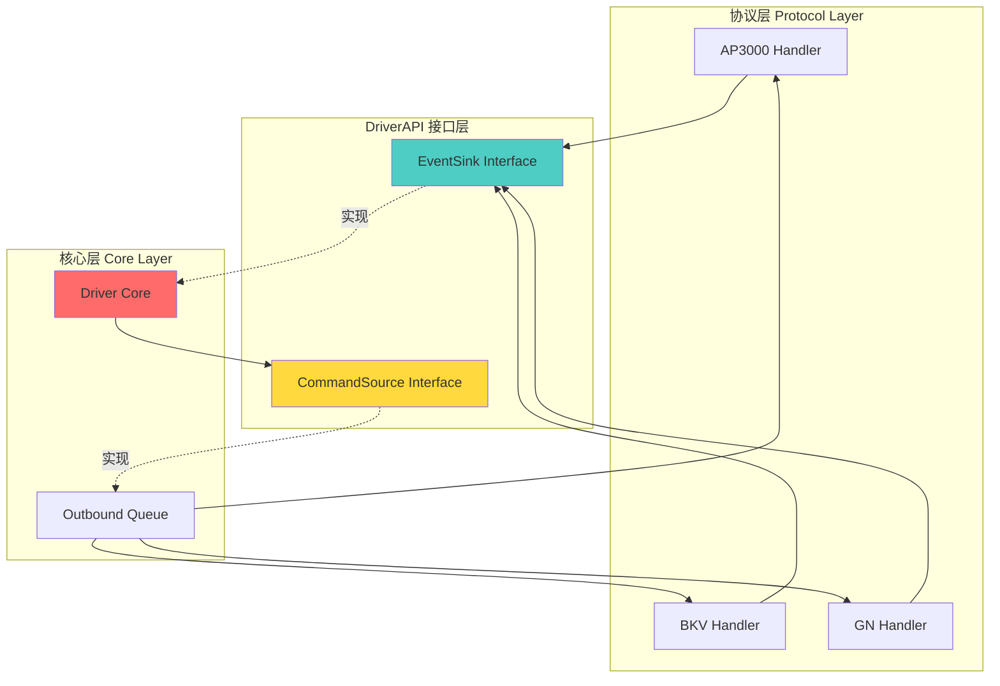
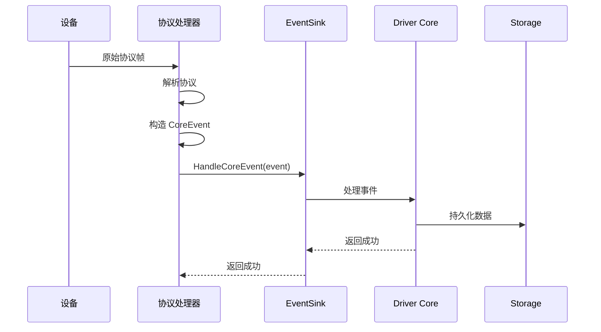
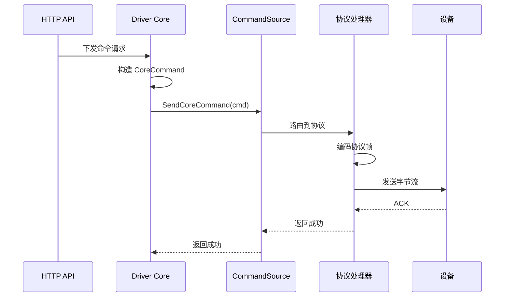

# DriverAPI Module - 驱动接口定义

> **导航**: [← 返回根目录](../../CLAUDE.md)
> **路径**: `internal/driverapi/`
> **最后更新**: 2025-11-28

---

## 📋 模块职责

DriverAPI 模块定义了**协议驱动与核心中间件**之间的交互契约，是系统架构的关键抽象层：

- **接口契约**: 定义协议驱动如何与核心交互
- **事件上报**: `EventSink` - 协议驱动上报规范化事件
- **命令下发**: `CommandSource` - 核心向协议驱动下发命令
- **解耦设计**: 协议层与核心层完全解耦

---

## 🏗️ 架构定位



---

## 📂 文件结构

```
driverapi/
└── api.go              # [核心] EventSink 和 CommandSource 接口定义
```

---

## 🔑 核心接口

### 1. EventSink - 事件接收器

**定义**:
```go
// EventSink 接收驱动上报的规范化事件,由中间件核心实现。
type EventSink interface {
    HandleCoreEvent(ctx context.Context, ev *coremodel.CoreEvent) error
}
```

**职责**:
- 接收协议驱动上报的规范化事件
- 由核心中间件（Driver Core）实现
- 协议驱动调用此接口上报事件

**使用场景**:
```go
// 协议处理器持有 EventSink
type BKVHandler struct {
    sink driverapi.EventSink
    logger *zap.Logger
}

// 处理设备状态上报
func (h *BKVHandler) handleStatusReport(frame *Frame) error {
    // 1. 解析协议数据
    deviceID, portNo, status := parseFrame(frame)

    // 2. 构造 CoreEvent
    event := &coremodel.CoreEvent{
        Type:     coremodel.EventTypeStatusChanged,
        DeviceID: deviceID,
        PortNo:   portNo,
        Payload: &coremodel.PortSnapshot{
            Status:  status,
            PowerW:  powerW,
            At:      time.Now(),
        },
    }

    // 3. 上报给核心
    return h.sink.HandleCoreEvent(context.Background(), event)
}
```

### 2. CommandSource - 命令源

**定义**:
```go
// CommandSource 向具体协议驱动发出规范化命令,由中间件核心实现调度。
// 在当前进程内实现阶段,可以简单地由协议适配层持有 CommandSource。
type CommandSource interface {
    SendCoreCommand(ctx context.Context, cmd *coremodel.CoreCommand) error
}
```

**职责**:
- 向协议驱动发送规范化命令
- 由核心中间件（Outbound Queue）实现
- 核心层通过此接口下发控制命令

**使用场景**:
```go
// 核心层下发命令
func (dc *DriverCore) SendCommand(ctx context.Context, phyID string, cmdType string) error {
    cmd := &coremodel.CoreCommand{
        DeviceID:    phyID,
        CommandType: cmdType,
        Payload:     payload,
    }

    return dc.commandSource.SendCoreCommand(ctx, cmd)
}

// 协议适配器接收命令
type ProtocolAdapter struct {
    handlers map[string]ProtocolHandler
}

func (pa *ProtocolAdapter) SendCoreCommand(ctx context.Context, cmd *coremodel.CoreCommand) error {
    // 1. 根据设备协议类型路由
    handler := pa.handlers[cmd.Protocol]

    // 2. 协议特定编码
    frameBytes := handler.Encode(cmd)

    // 3. 发送到设备
    return handler.Send(cmd.DeviceID, frameBytes)
}
```

---

## 🔄 数据流向

### 上行流（事件上报）



### 下行流（命令下发）



---

## 🎯 设计原则

### 1. 依赖倒置原则 (DIP)

**问题**: 如果协议层直接依赖核心层，会导致：
- 协议层耦合核心实现
- 难以测试和替换
- 违反单向依赖原则

**解决**: 通过 DriverAPI 接口抽象
```
协议层 --> DriverAPI <-- 核心层
```

### 2. 面向接口编程

**协议处理器**:
```go
// ✅ 依赖抽象接口
type BKVHandler struct {
    sink driverapi.EventSink  // 接口类型
}

// ❌ 依赖具体实现
type BKVHandler struct {
    core *app.DriverCore  // 具体类型
}
```

### 3. 单一职责原则 (SRP)

- **EventSink**: 只负责接收事件
- **CommandSource**: 只负责发送命令
- 两个接口职责明确，互不干扰

### 4. 开闭原则 (OCP)

- 新增协议：实现新的处理器，复用 EventSink
- 新增命令：扩展 CoreCommand 类型，无需修改接口

---

## 🧪 测试与Mock

### Mock EventSink

```go
// 使用 gomock 生成 mock
//go:generate mockgen -destination=mocks/mock_event_sink.go -package=mocks github.com/taoyao-code/iot-server/internal/driverapi EventSink

// 测试协议处理器
func TestBKVHandler_HandleStatusReport(t *testing.T) {
    ctrl := gomock.NewController(t)
    defer ctrl.Finish()

    // 创建 mock EventSink
    mockSink := mocks.NewMockEventSink(ctrl)

    // 设置期望
    mockSink.EXPECT().
        HandleCoreEvent(gomock.Any(), gomock.Any()).
        DoAndReturn(func(ctx context.Context, ev *coremodel.CoreEvent) error {
            assert.Equal(t, coremodel.EventTypeStatusChanged, ev.Type)
            return nil
        })

    // 测试处理器
    handler := &BKVHandler{sink: mockSink}
    err := handler.handleStatusReport(testFrame)

    assert.NoError(t, err)
}
```

### Mock CommandSource

```go
// 测试核心逻辑
func TestDriverCore_SendCommand(t *testing.T) {
    ctrl := gomock.NewController(t)
    defer ctrl.Finish()

    mockCmdSource := mocks.NewMockCommandSource(ctrl)

    mockCmdSource.EXPECT().
        SendCoreCommand(gomock.Any(), gomock.Any()).
        Return(nil)

    core := &DriverCore{commandSource: mockCmdSource}
    err := core.SendCommand(context.Background(), "dev123", "start")

    assert.NoError(t, err)
}
```

---

## 📋 实现清单

### EventSink 实现者

| 组件 | 文件 | 说明 |
|------|------|------|
| Driver Core | `internal/app/driver_core.go` | 核心事件处理引擎 |

**实现示例**:
```go
type DriverCore struct {
    repo   storage.CoreRepo
    logger *zap.Logger
}

func (dc *DriverCore) HandleCoreEvent(ctx context.Context, ev *coremodel.CoreEvent) error {
    switch ev.Type {
    case coremodel.EventTypeConnection:
        return dc.handleConnectionEvent(ctx, ev)
    case coremodel.EventTypeStatusChanged:
        return dc.handleStatusEvent(ctx, ev)
    case coremodel.EventTypeSessionEnded:
        return dc.handleSessionEndedEvent(ctx, ev)
    default:
        return fmt.Errorf("unknown event type: %s", ev.Type)
    }
}
```

### CommandSource 实现者

| 组件 | 文件 | 说明 |
|------|------|------|
| Outbound Queue | `internal/outbound/worker.go` | 命令队列与下发 |
| Protocol Adapter | `internal/protocol/adapter/` | 协议适配层 |

**实现示例**:
```go
type OutboundWorker struct {
    protocols map[string]ProtocolHandler
}

func (w *OutboundWorker) SendCoreCommand(ctx context.Context, cmd *coremodel.CoreCommand) error {
    // 1. 获取协议处理器
    handler, ok := w.protocols[cmd.Protocol]
    if !ok {
        return fmt.Errorf("protocol not found: %s", cmd.Protocol)
    }

    // 2. 编码命令
    frameBytes, err := handler.EncodeCommand(cmd)
    if err != nil {
        return err
    }

    // 3. 发送到设备
    return handler.SendToDevice(cmd.DeviceID, frameBytes)
}
```

### EventSink 调用者

| 组件 | 文件 | 说明 |
|------|------|------|
| AP3000 Handler | `internal/protocol/ap3000/handlers.go` | AP3000 协议处理器 |
| BKV Handler | `internal/protocol/bkv/handlers.go` | BKV 协议处理器 |
| GN Handler | `internal/protocol/gn/handlers.go` | GN 协议处理器 |

---

## 🔍 最佳实践

### 1. 错误处理

```go
func (h *BKVHandler) handleEvent(frame *Frame) error {
    event := buildEvent(frame)

    if err := h.sink.HandleCoreEvent(context.Background(), event); err != nil {
        // 记录日志，但不中断协议处理流程
        h.logger.Error("failed to handle event",
            zap.String("device_id", event.DeviceID),
            zap.Error(err),
        )
        // 根据业务决定是否返回错误
        return nil  // 或 return err
    }

    return nil
}
```

### 2. Context 传递

```go
// ✅ 传递 context，支持超时和取消
func (h *BKVHandler) handleEvent(ctx context.Context, frame *Frame) error {
    event := buildEvent(frame)
    return h.sink.HandleCoreEvent(ctx, event)
}

// ❌ 硬编码 context.Background()
func (h *BKVHandler) handleEvent(frame *Frame) error {
    event := buildEvent(frame)
    return h.sink.HandleCoreEvent(context.Background(), event)
}
```

### 3. 接口隔离

```go
// ✅ 协议处理器只依赖 EventSink
type BKVHandler struct {
    sink driverapi.EventSink
}

// ❌ 协议处理器依赖整个核心
type BKVHandler struct {
    core *app.DriverCore
    repo storage.CoreRepo
    redis *redis.Client
}
```

---

## 🔗 相关文档

- [Core Model](../coremodel/CLAUDE.md) - 核心数据模型（CoreEvent/CoreCommand）
- [App Module](../app/CLAUDE.md) - Driver Core 实现
- [Protocol Module](../protocol/CLAUDE.md) - 协议处理器
- [Outbound Module](../outbound/CLAUDE.md) - 命令下发实现

---

**最后更新**: 2025-11-28
**维护者**: Architecture Team
