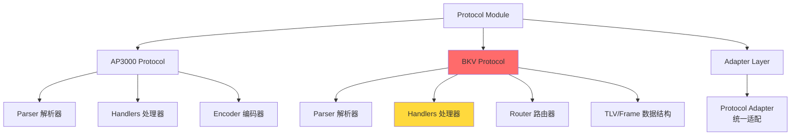
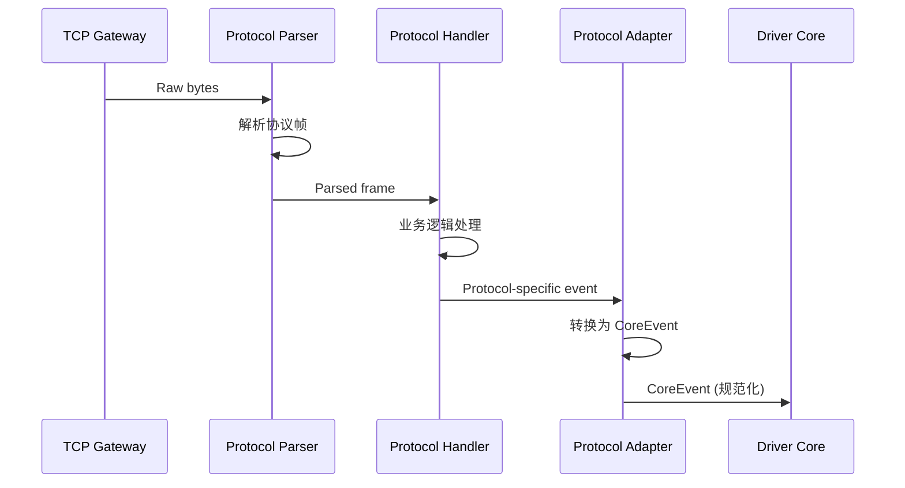

# Protocol Module - 多协议解析器

> **导航**: [← 返回根目录](../../CLAUDE.md)
> **路径**: `internal/protocol/`
> **最后更新**: 2025-11-28

---

## 📋 模块职责

协议模块负责处理多种充电桩设备的通信协议，包括协议帧的解析、编码、业务逻辑处理和事件上报。

### 核心功能

- **协议解析**: 解析 TCP 字节流为结构化协议帧
- **协议编码**: 将命令结构编码为协议字节流
- **业务处理**: 处理心跳、状态上报、启停命令等业务逻辑
- **事件上报**: 通过 `driverapi.EventSink` 上报规范化事件

---

## 🏗️ 模块结构



### 子模块说明

| 子模块 | 说明 | 关键文件 |
|--------|------|---------|
| `ap3000/` | AP3000 协议实现 | `parser.go`, `handlers.go`, `encoder.go` |
| `bkv/` | BKV 协议实现（⚠️ 重构中） | `parser.go`, `handlers.go`, `router_handlers.go`, `tlv.go` |
| `adapter/` | 协议适配层 | `adapter.go` |

---

## 🔑 核心概念

### 1. 协议处理流程



### 2. 关键接口

**driverapi.EventSink**
```go
type EventSink interface {
    HandleCoreEvent(ctx context.Context, ev *coremodel.CoreEvent) error
}
```

每个协议处理器通过此接口向核心上报事件。

---

## 📦 AP3000 协议

### 文件结构
```
ap3000/
├── parser.go          # 协议帧解析
├── handlers.go        # 业务逻辑处理
├── encoder.go         # 协议编码
├── adapter.go         # 协议适配器
├── parser_test.go     # 解析器测试
└── decode_test.go     # 解码测试
```

### 主要功能
- 设备心跳处理
- 充电状态上报
- 启停命令下发
- 端口状态查询

### 关键数据结构
```go
type AP3000Frame struct {
    Header   FrameHeader
    Command  byte
    Data     []byte
    Checksum byte
}
```

---

## 📦 BKV 协议（重点）

> ⚠️ **当前重构中**: 优化状态聚簇解析逻辑
> 参考: `openspec/changes/refactor-bkv-status-cluster-parsing/`

### 文件结构
```
bkv/
├── parser.go              # 协议帧解析
├── handlers.go            # 核心业务处理
├── router_handlers.go     # 路由处理器
├── handlers_helper.go     # 辅助函数
├── tlv.go                 # TLV 数据结构
├── frame.go               # 协议帧定义
├── card.go                # 刷卡数据处理
├── command_source.go      # 命令源（出站）
└── handlers_test.go       # 处理器测试
```

### 主要功能
- **状态上报**: 端口状态、功率数据、告警信息
- **刷卡认证**: IC 卡刷卡事件处理
- **启停控制**: 启动/停止充电命令
- **查询命令**: 状态查询、参数查询

### TLV 数据结构

```go
type TLV struct {
    Tag    uint16  // 标签
    Length uint16  // 长度
    Value  []byte  // 值
}
```

**关键 Tag 定义**:
- `0x01`: 设备 ID
- `0x02`: 端口状态
- `0x03`: 功率数据
- `0x04`: 告警信息
- `0x05`: IC 卡数据

### 状态聚簇解析

BKV 协议支持一次上报多个端口的状态信息（状态聚簇）：

```
Frame:
  Command: 0x0E (状态上报)
  TLVs:
    - Tag=0x01, Value=设备ID
    - Tag=0x02, Value=[端口1状态, 端口2状态, ...]
    - Tag=0x03, Value=[端口1功率, 端口2功率, ...]
```

**重构目标**:
- 统一状态解析逻辑
- 优化聚簇状态的拆分和映射
- 简化端口状态更新流程

---

## 🔧 开发指南

### 添加新协议

1. **创建协议目录**
   ```bash
   mkdir internal/protocol/new_protocol
   ```

2. **实现核心组件**
   ```go
   // parser.go
   type NewProtocolParser struct {}
   func (p *NewProtocolParser) Parse(data []byte) (*Frame, error)

   // handlers.go
   type NewProtocolHandler struct {
       sink driverapi.EventSink
   }
   func (h *NewProtocolHandler) Handle(frame *Frame) error

   // encoder.go
   func Encode(cmd *coremodel.CoreCommand) ([]byte, error)
   ```

3. **注册到网关**
   ```go
   // internal/gateway/conn_handler.go
   switch protocol {
   case "new_protocol":
       handler = newprotocol.NewHandler(sink)
   }
   ```

4. **添加测试**
   ```go
   // parser_test.go
   func TestNewProtocolParser(t *testing.T) {
       // 测试解析逻辑
   }
   ```

### 修改现有协议

**示例: 为 BKV 添加新命令处理**

```go
// handlers.go
func (h *BKVHandler) handleNewCommand(frame *Frame) error {
    // 1. 解析 TLV 数据
    tlvs, err := parseTLVs(frame.Data)
    if err != nil {
        return err
    }

    // 2. 提取业务数据
    deviceID := getTLVValue(tlvs, 0x01)

    // 3. 构造 CoreEvent
    event := &coremodel.CoreEvent{
        DeviceID: deviceID,
        Type:     coremodel.EventTypeNewCommand,
        Data:     ...,
    }

    // 4. 上报事件
    return h.sink.HandleCoreEvent(ctx, event)
}
```

---

## 🧪 测试

### 运行协议测试

```bash
# 测试所有协议
go test ./internal/protocol/...

# 测试特定协议
go test ./internal/protocol/bkv -v

# 测试覆盖率
go test ./internal/protocol/... -coverprofile=coverage.out
```

### 测试数据

测试协议数据位于:
```
tests/protocol/
├── 2.txt           # 样本协议数据
├── cs.txt          # 测试数据
├── zs-1.txt        # 状态数据
└── 正式代码.txt     # 生产数据
```

### 测试原则

- **单元测试**: 测试解析器、编码器逻辑
- **集成测试**: 测试完整的帧处理流程
- **边界测试**: 测试异常帧、错误数据
- **性能测试**: 测试高并发下的解析性能

---

## 🔍 关键文件说明

### BKV 协议关键文件

**handlers.go** (核心业务处理)
- `HandleHeartbeat()` - 心跳处理
- `HandleStatusReport()` - 状态上报处理
- `HandleCardEvent()` - 刷卡事件处理
- `HandleStartStop()` - 启停命令处理

**router_handlers.go** (路由处理)
- `Route()` - 根据命令类型路由到对应处理器
- `handleCommand0x0E()` - 状态上报路由
- `handleCommand0x10()` - 刷卡事件路由

**tlv.go** (TLV 数据结构)
- `ParseTLVs()` - 解析 TLV 列表
- `GetTLVValue()` - 获取指定 Tag 的值
- `EncodeTLV()` - 编码 TLV 数据

**frame.go** (协议帧)
- `Frame` 结构定义
- `ValidateChecksum()` - 校验和验证
- `EncodeFrame()` - 帧编码

---

## 📊 当前状态与未来规划

### ✅ 已完成
- AP3000 协议完整实现
- BKV 基础协议解析
- GN 组网协议支持
- 协议适配层抽象

### 🚧 进行中
- **BKV 状态聚簇解析优化** (重构中)
- BKV 端口状态处理简化
- 协议测试覆盖率提升

### 📋 计划中
- 协议版本兼容性处理
- 协议性能优化
- 协议文档生成工具

---

## 🔗 相关文档

- [协议规范](../../docs/协议/) - 详细协议文档
- [Driver API](../driverapi/CLAUDE.md) - 驱动接口说明
- [Core Model](../coremodel/CLAUDE.md) - 核心数据模型
- [OpenSpec BKV重构](../../openspec/changes/refactor-bkv-status-cluster-parsing/) - BKV 重构提案

---

**最后更新**: 2025-11-28
**维护者**: Protocol Team
