# 充电流程架构图与协议交互图

## 🏗️ 整体系统架构

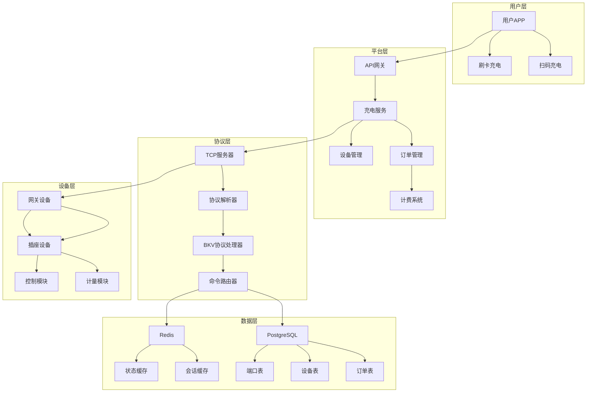

## ⚡ 完整充电流程时序图

### 正常充电流程
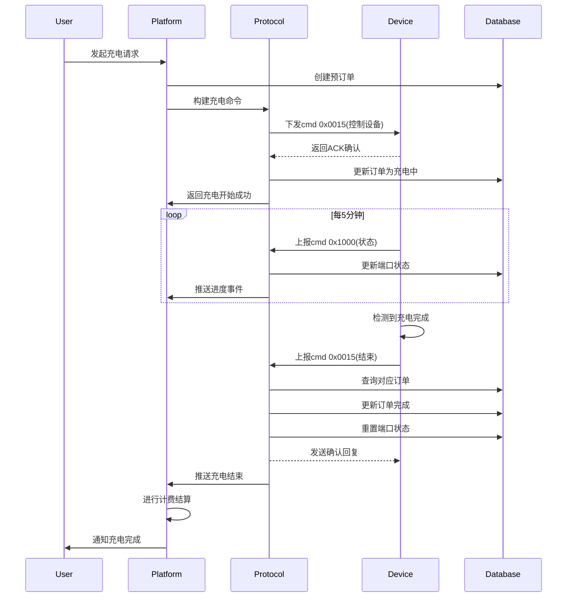

### 异常处理流程
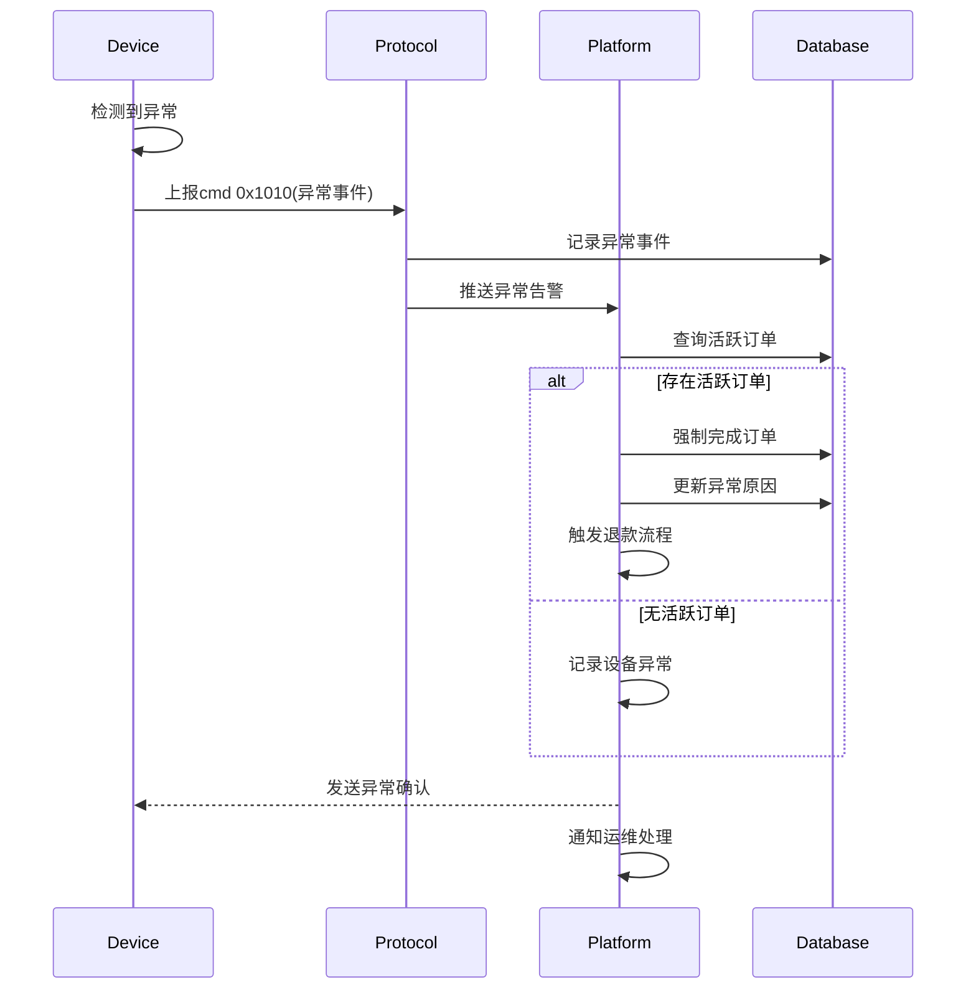

## 🔧 协议数据流图

### BKV协议帧处理流程
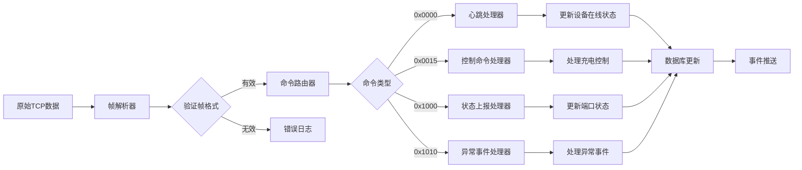

### 充电命令详细流程
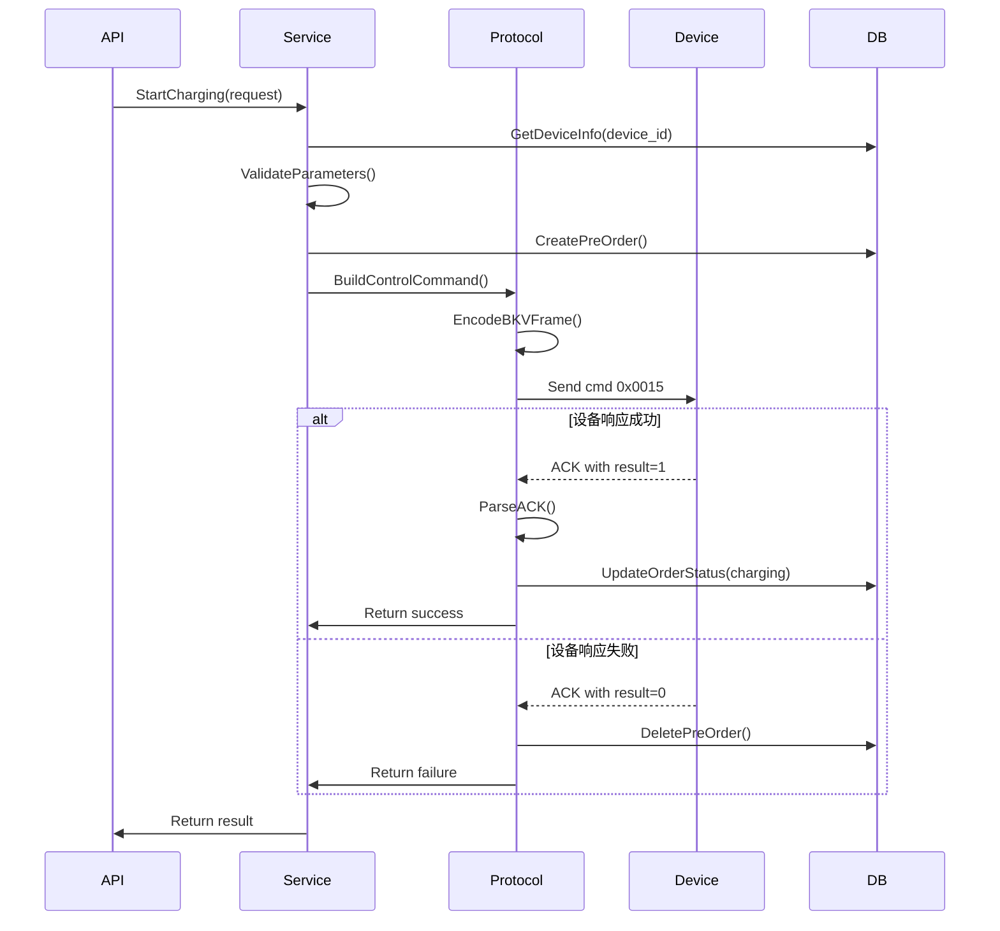

## 📊 数据状态转换图

### 订单状态机
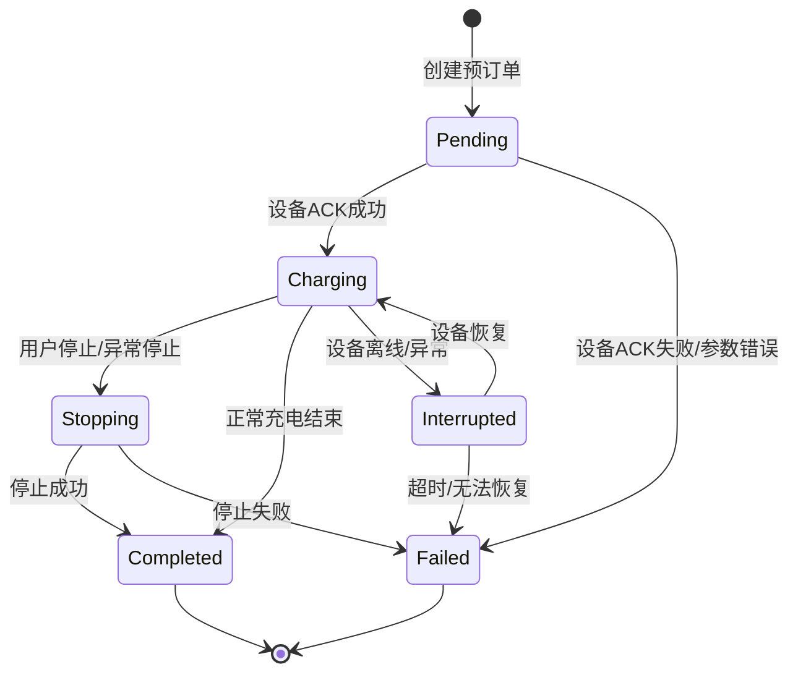

### 端口状态转换
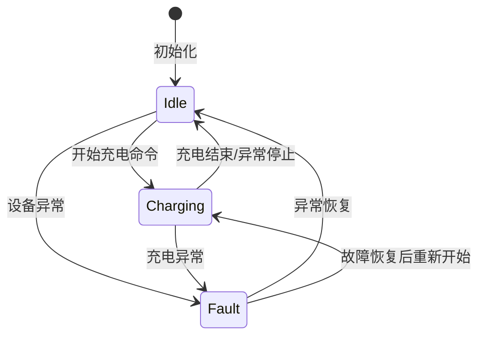

## 🔍 协议字段详细解析图

### 控制命令帧结构 (cmd 0x0015)
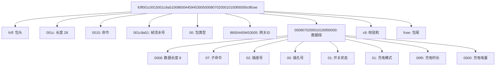

### 状态上报帧结构 (cmd 0x1000 BKV)
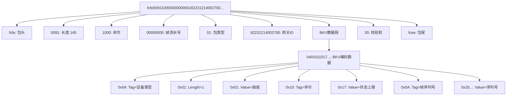

## ⚠️ 错误处理流程图

### 协议错误处理
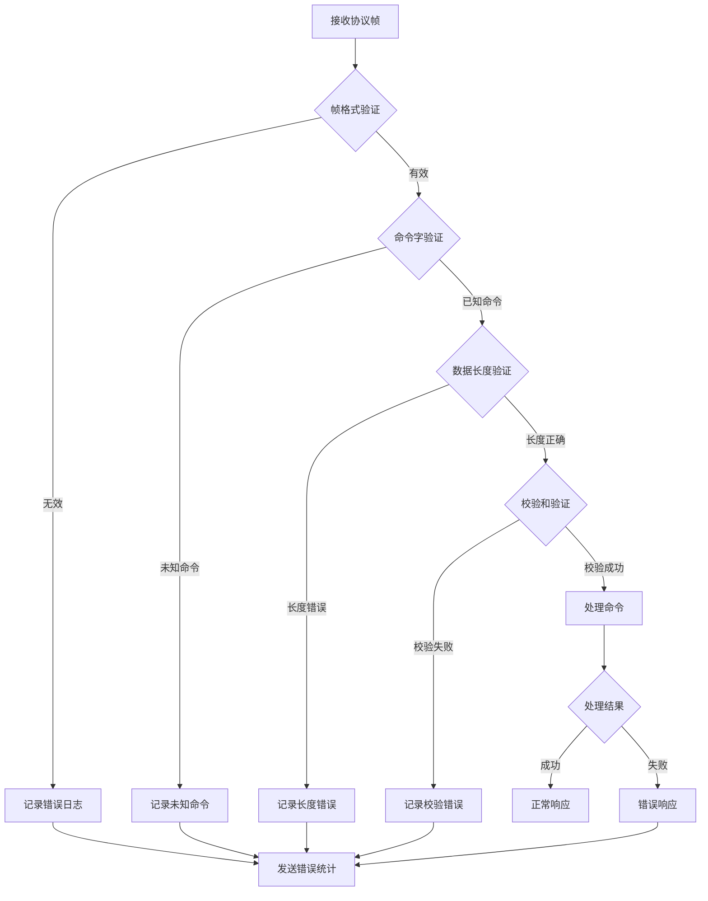

### 业务错误处理
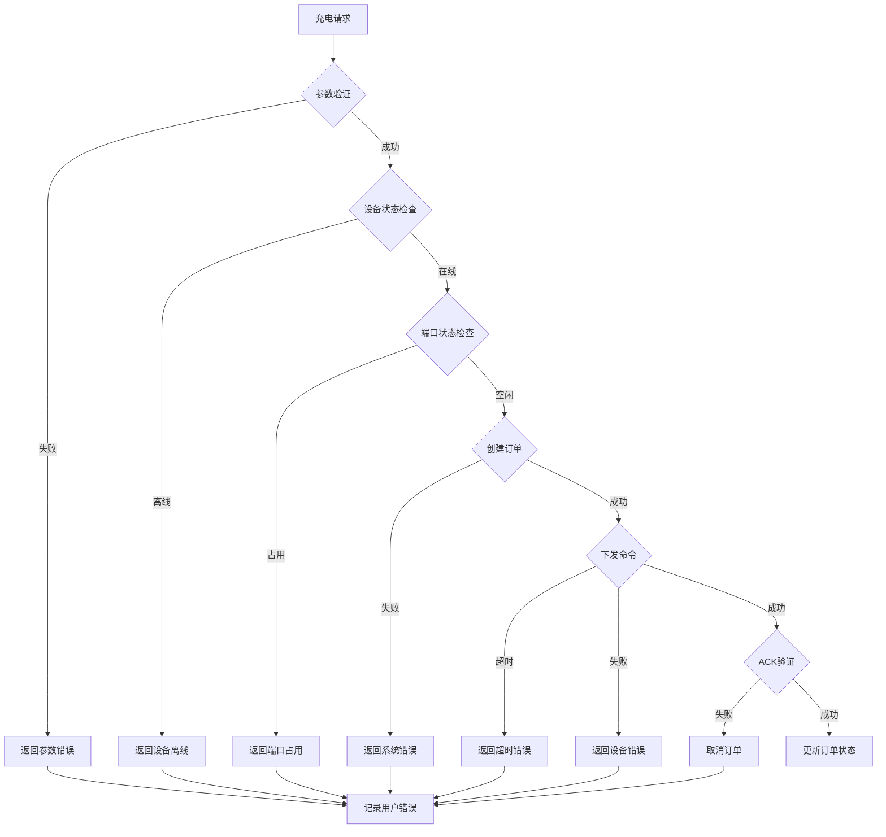

## 📈 性能监控指标图

### 关键性能指标
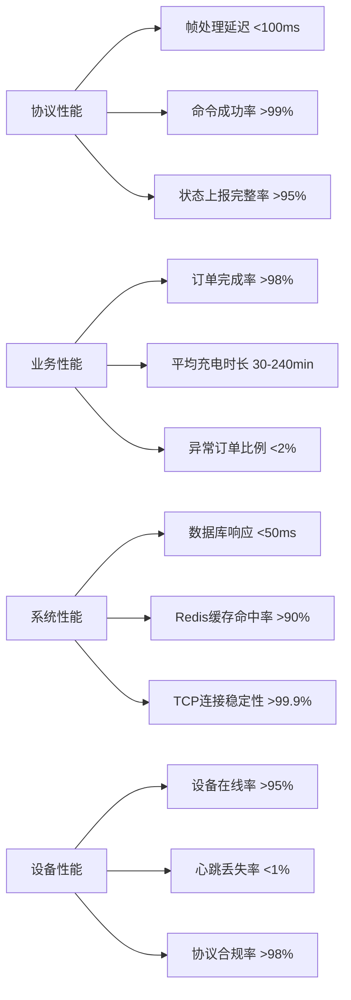

## 🔐 安全验证流程

### 数据完整性验证
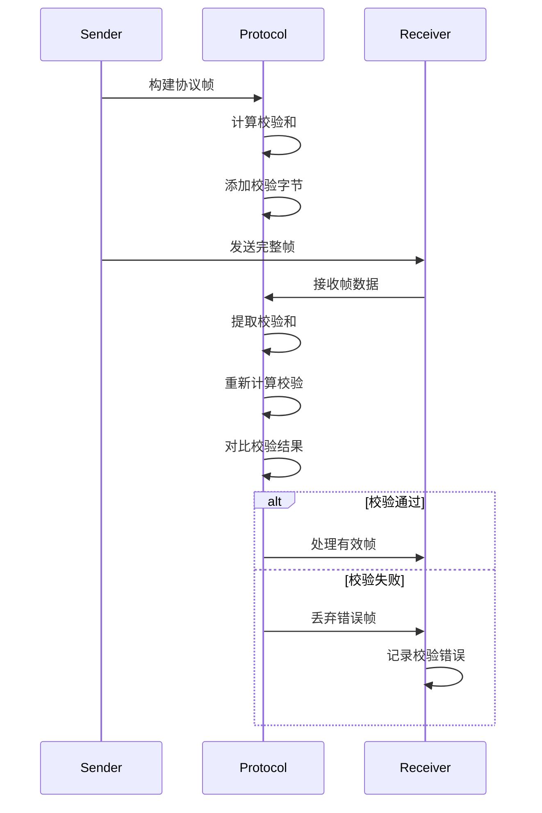

### 业务数据验证
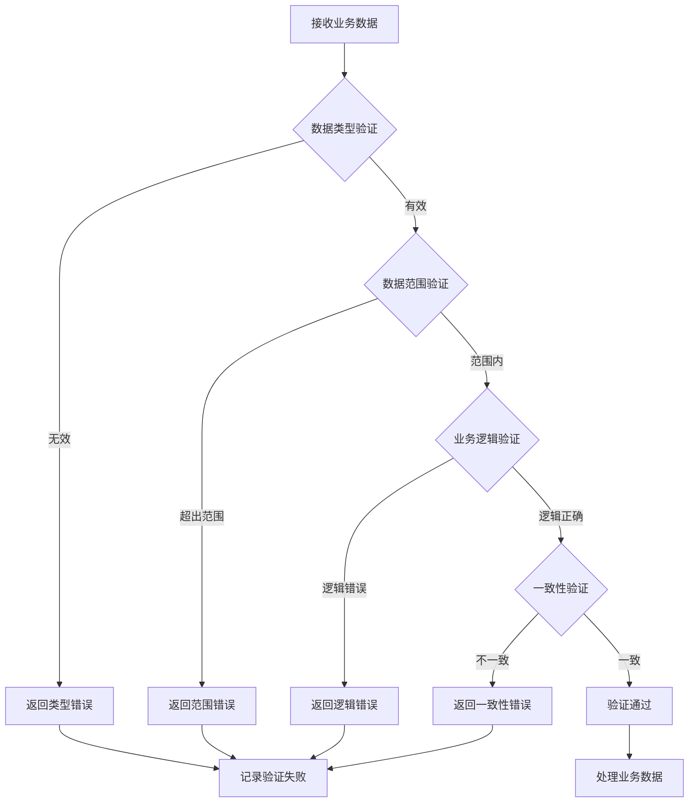

这些架构图和流程图提供了充电流程的全方位可视化展示，包括：
- 系统整体架构和组件关系
- 详细的协议交互时序
- 数据状态转换逻辑
- 协议字段结构解析
- 错误处理流程
- 性能监控指标
- 安全验证机制

这些图表可以直接用于技术文档、培训材料和系统监控dashboard中。